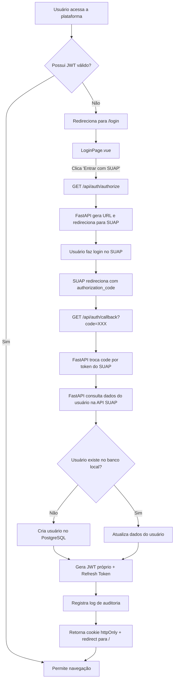

# 📋 SDD — Mini-spec de Login: IFAL Projetos

> **Módulo:** Autenticação e Controle de Acesso  
> **Projeto:** IFAL Projetos — Gestão Acadêmica  
> **Stack Front-end:** Vue.js + Vite + Vanilla CSS  
> **Stack Back-end:** FastAPI (Python) + PostgreSQL  
> **Autenticação:** OAuth2 via SUAP (Backend-For-Frontend)  
> **Data:** 26/05/2026

---

## 1. Contexto e Objetivos

O módulo de Login é a porta de entrada para a plataforma **IFAL Projetos**, garantindo o acesso seguro e unificado para os diferentes perfis de usuários institucionais (Aluno, Orientador, Coordenador e Administrador). A autenticação é delegada integralmente ao **SUAP** via OAuth2, utilizando o padrão **Backend-For-Frontend (BFF)**.

**Objetivos Principais:**
- Autenticar usuários via SUAP sem armazenar senhas localmente
- Identificar e redirecionar corretamente cada tipo de usuário
- Proteger rotas privadas usando auth store (Pinia) e navigation guards (Vue Router)
- Cumprir os Requisitos Não Funcionais de segurança (RNF003, RNF004, RNF008)

---

## 2. Decisão Arquitetural: Modelo de Autenticação

> [!IMPORTANT]
> **Decisão — Autenticação exclusiva via SUAP (OAuth2 Authorization Code Flow)**
>
> A plataforma utiliza o SUAP como provedor de identidade único. Não há cadastro local de senhas, nem fluxos de `forgot-password` ou `reset-password`. Os usuários são criados automaticamente no banco local no primeiro login via SUAP.

### Implicações

| Aspecto | Implementação |
|---------|---------------|
| Registro de usuários | Automático no primeiro login via SUAP (sem cadastro manual) |
| Recuperação de senha | Responsabilidade do SUAP (fora do escopo da aplicação) |
| Credenciais | Gerenciadas pelo SUAP — aplicação não armazena senhas |
| Sessão | JWT próprio em cookie `httpOnly` + refresh token server-side |
| Dados do usuário | Obtidos da API do SUAP e sincronizados no banco local |

---

## 3. Perfis e Controle de Acesso (RF008)

| Perfil | Role (enum) | Descrição e Permissões |
|--------|-------------|------------------------|
| **Administrador** | `admin` | Acesso total: configuração, manutenção, auditoria e gestão de usuários |
| **Coordenador** | `coordinator` | Relatórios consolidados, supervisão de projetos do curso |
| **Orientador** | `advisor` | Acompanhamento de tarefas, feedback e avaliação de entregas |
| **Aluno** | `student` | Gestão do próprio projeto, Kanban, entregas e repositórios |

> [!NOTE]
> O mapeamento de perfil SUAP → role local deve ser definido na configuração do backend (ex: tipo de vínculo no SUAP determina o role).

---

## 4. Arquitetura e Fluxo de Autenticação (BFF)



### Estratégia de Sessão e Tokens (RNF004)

> [!IMPORTANT]
> A sessão **não** utiliza `localStorage` nem `sessionStorage`. O acesso é controlado por cookies seguros gerenciados pelo FastAPI.

| Componente | Tipo | TTL | Armazenamento |
|-----------|------|-----|---------------|
| **Access Token** | JWT assinado (HS256) | 15 minutos | Cookie `httpOnly`, `Secure`, `SameSite=Lax` |
| **Refresh Token** | UUID opaco | 30 min de inatividade (sliding window) | Tabela `refresh_tokens` no PostgreSQL |

**Fluxo de renovação:**
1. Front-end faz requisição protegida → FastAPI verifica o JWT no cookie
2. Se expirado (>15 min), verifica o refresh token automaticamente
3. Se o refresh token for válido e dentro da janela de 30 min, emite novo JWT e renova o refresh token
4. Se expirado (>30 min de inatividade), retorna `HTTP 401` → front-end redireciona para `/login`

---

## 5. Especificação da API REST de Autenticação

### 5.1 Endpoints

| Método | Rota | Descrição | Auth |
|--------|------|-----------|------|
| `GET` | `/api/auth/authorize` | Redireciona para tela de login do SUAP | Público |
| `GET` | `/api/auth/callback` | Recebe code do SUAP, troca por token, emite JWT | Público |
| `POST` | `/api/auth/logout` | Invalidar sessão e limpar cookies | Autenticado |
| `GET` | `/api/auth/me` | Retornar dados do usuário logado | Autenticado |
| `POST` | `/api/auth/refresh` | Renovar access token via refresh token | Cookie |

### 5.2 Contratos

#### `GET /api/auth/authorize`

**Response:** `302 Redirect` para a URL de autorização do SUAP com os parâmetros OAuth2:
```
https://suap.ifal.edu.br/o/authorize/?
  response_type=code&
  client_id=CLIENT_ID&
  redirect_uri=https://app.exemplo.com/api/auth/callback&
  scope=identificacao email
```

#### `GET /api/auth/callback?code=AUTHORIZATION_CODE`

**Response 200 (Sucesso):** Redirect para `/` com cookie `Set-Cookie` contendo o JWT.

**Response 401 (Code inválido):**
```json
{
  "error": "INVALID_CODE",
  "message": "Código de autorização inválido ou expirado."
}
```

#### `GET /api/auth/me`

**Response 200:**
```json
{
  "user": {
    "id": "uuid",
    "name": "Nome Completo",
    "email": "aluno@ifal.edu.br",
    "role": "student",
    "suap_id": "12345",
    "avatar_url": "https://suap.ifal.edu.br/media/..."
  }
}
```

**Response 401:**
```json
{
  "error": "UNAUTHORIZED",
  "message": "Sessão expirada ou inválida."
}
```

---

## 6. Modelo de Dados

### 6.1 Tabela `users`

```sql
CREATE TABLE users (
    id            UUID PRIMARY KEY DEFAULT gen_random_uuid(),
    suap_id       VARCHAR(50) UNIQUE NOT NULL,
    name          VARCHAR(255) NOT NULL,
    email         VARCHAR(255) UNIQUE NOT NULL,
    role          VARCHAR(20) NOT NULL CHECK (role IN ('admin', 'coordinator', 'advisor', 'student')),
    avatar_url    VARCHAR(500),
    is_active     BOOLEAN DEFAULT TRUE,
    created_at    TIMESTAMPTZ DEFAULT NOW(),
    updated_at    TIMESTAMPTZ DEFAULT NOW()
);

CREATE INDEX idx_users_suap_id ON users(suap_id);
CREATE INDEX idx_users_email ON users(email);
CREATE INDEX idx_users_role ON users(role);
```

### 6.2 Tabela `refresh_tokens`

```sql
CREATE TABLE refresh_tokens (
    id         UUID PRIMARY KEY DEFAULT gen_random_uuid(),
    user_id    UUID NOT NULL REFERENCES users(id) ON DELETE CASCADE,
    token      VARCHAR(255) UNIQUE NOT NULL,
    expires_at TIMESTAMPTZ NOT NULL,
    created_at TIMESTAMPTZ DEFAULT NOW()
);

CREATE INDEX idx_refresh_tokens_user ON refresh_tokens(user_id);
CREATE INDEX idx_refresh_tokens_token ON refresh_tokens(token);
```

### 6.3 Tabela `auth_audit_log`

```sql
CREATE TABLE auth_audit_log (
    id         BIGSERIAL PRIMARY KEY,
    user_id    UUID REFERENCES users(id),
    email      VARCHAR(255) NOT NULL,
    action     VARCHAR(30) NOT NULL CHECK (action IN (
        'login_success', 'login_failure', 'logout', 'token_refresh'
    )),
    ip_address INET,
    user_agent TEXT,
    metadata   JSONB,
    created_at TIMESTAMPTZ DEFAULT NOW()
);

CREATE INDEX idx_auth_audit_user ON auth_audit_log(user_id);
CREATE INDEX idx_auth_audit_action ON auth_audit_log(action);
CREATE INDEX idx_auth_audit_created ON auth_audit_log(created_at);
```

---

## 7. Segurança e Auditoria (RF009 / RNF003 / RNF004 / RNF008)

### 7.1 Requisitos de Segurança

| Requisito | Implementação |
|-----------|---------------|
| **RNF003** — HTTPS/TLS | Todas as requisições sobre HTTPS. Certificados TLS no deploy. |
| **RNF004** — Expiração 30 min | Refresh token com sliding window de 30 min. Access token com TTL de 15 min. |
| **RNF008** — Auditoria | Todo evento de autenticação registrado na tabela `auth_audit_log`. |

> [!NOTE]
> Não há armazenamento local de senhas (bcrypt não se aplica). A segurança de credenciais é responsabilidade do SUAP.

### 7.2 Log de Auditoria — Campos Registrados

| Campo | Descrição |
|-------|-----------|
| `user_id` | UUID do usuário (se identificado) |
| `email` | E-mail do usuário |
| `action` | Tipo: `login_success`, `login_failure`, `logout`, `token_refresh` |
| `ip_address` | IP da requisição |
| `user_agent` | User-Agent do navegador |
| `metadata` | JSON com dados adicionais (ex: suap_id, motivo de falha) |
| `created_at` | Timestamp UTC |

---

## 8. Requisitos Específicos do Módulo de Login

### 8.1 Requisitos Funcionais (RF)

- **RF-L01:** O sistema deve autenticar usuários exclusivamente via SUAP OAuth2, redirecionando para a tela de login do SUAP.
- **RF-L02:** O sistema deve bloquear acesso a rotas privadas e redirecionar usuários sem sessão para a página de login (navigation guard do Vue Router).
- **RF-L03:** O sistema deve apresentar feedback visual (Toast) caso ocorra erro no fluxo de autenticação.
- **RF-L04:** O sistema deve manter os dados do usuário acessíveis via `GET /api/auth/me` e consumidos pelo auth store (Pinia).
- **RF-L05:** O sistema deve registrar toda tentativa de autenticação na tabela `auth_audit_log`.
- **RF-L06:** O sistema deve criar automaticamente o registro do usuário no banco local no primeiro login via SUAP.

### 8.2 Requisitos Não Funcionais (RNF) Aplicáveis

- **RNF003:** Credenciais trafegam exclusivamente via HTTPS/TLS.
- **RNF004:** Access token JWT com TTL de 15 min; refresh token com sliding window de 30 min.
- **RNF007:** O endpoint de callback deve suportar picos de 2.000 requisições simultâneas.
- **RNF008:** Todo evento de autenticação auditado com data, hora, usuário, IP e ação.

---

## 9. Rastreabilidade de Requisitos

| Requisito (README) | Seção neste documento | Status |
|---------------------|----------------------|--------|
| **RF008** — Controle de acesso por perfis | §3, §5, §6.1 | ✅ Especificado com enum de roles |
| **RF009** — Log de operações críticas | §7.2, §6.3 | ✅ Tabela `auth_audit_log` definida |
| **RNF003** — HTTPS/TLS | §7.1 | ✅ Documentado para deploy |
| **RNF004** — Sessão 30 min | §4 | ✅ JWT httpOnly + refresh token |
| **RNF007** — 2.000 usuários simultâneos | §8.2 | ✅ Teste de carga especificado |
| **RNF008** — Auditoria completa | §7.1, §7.2, §6.3 | ✅ Todos os eventos auditados |
