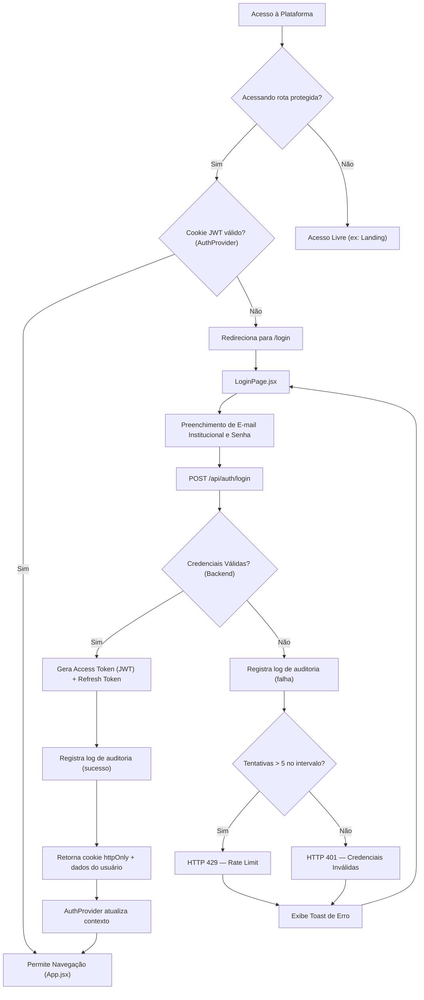

# 📋 SDD — Mini-spec de Login: IFAL Projetos

> **Módulo:** Autenticação e Controle de Acesso  
> **Projeto:** IFAL Projetos — Gestão Acadêmica  
> **Stack Front-end:** React 18 + Vite 5 + Vanilla CSS  
> **Stack Back-end:** Node.js 20 + Express 5 + PostgreSQL 16  
> **Data:** 13/05/2026

---

## 1. Contexto e Objetivos

O módulo de Login é a porta de entrada para a plataforma **IFAL Projetos**, garantindo o acesso seguro e unificado para os diferentes perfis de usuários institucionais (Aluno, Orientador, Coordenador e Administrador). O sistema busca simplificar a gestão de projetos acadêmicos e TCCs, e o controle de acesso é fundamental para manter a rastreabilidade e segurança das entregas.

**Objetivos Principais:**
- Garantir a autenticação segura dos usuários, de acordo com as restrições e padrões da instituição.
- Identificar e redirecionar corretamente cada tipo de usuário para o sistema.
- Proteger rotas privadas utilizando um contexto de autenticação global (`AuthProvider` e `ProtectedRoute`).
- Cumprir os Requisitos Não Funcionais de segurança estipulados no Documento de Visão (RNF003, RNF004, RNF008).

---

## 2. Decisão Arquitetural: Modelo de Autenticação

> [!IMPORTANT]
> **Decisão tomada para a v1.0 — Cadastro Próprio**
>
> Conforme identificado na dependência listada no Documento de Visão (§7.2), a definição do modelo de autenticação era um pré-requisito bloqueante. A decisão para a versão 1.0 é:
>
> **Cadastro próprio com credenciais institucionais (e-mail `@ifal.edu.br` + senha).**
>
> A integração com SSO institucional (SAML/OIDC) fica planejada para a **v2.0**, pois exige acordo com o setor de TI e configuração de provedor de identidade que estão fora do prazo da v1.0.

### Implicações desta decisão

| Aspecto | O que é necessário na v1.0 |
|---------|---------------------------|
| Registro de usuários | Cadastro via painel Admin (sem auto-registro na v1.0) |
| Recuperação de senha | Fluxo de reset via e-mail institucional (SMTP) |
| Credenciais | E-mail institucional + senha com hash bcrypt (RNF004) |
| Sessão | JWT com cookie `httpOnly` + refresh token server-side (RNF004) |
| SSO | Fora do escopo v1.0 — preparar interface para futura integração |

---

## 3. Perfis e Controle de Acesso (RF008)

O sistema deve reconhecer e tratar o acesso para os seguintes **4 perfis** previstos no Documento de Visão e no RF008:

| Perfil | Role (enum) | Descrição e Permissões |
|--------|-------------|------------------------|
| **Administrador** | `admin` | Acesso total à plataforma para configuração, manutenção, auditoria e gestão de usuários. |
| **Coordenador** | `coordinator` | Visão consolidada de relatórios, supervisão dos projetos do curso e desempenho das equipes. |
| **Orientador** | `advisor` | Acesso restrito para acompanhar tarefas, fornecer feedback e avaliar entregas dos projetos sob sua orientação. |
| **Aluno** | `student` | Acesso para gerir seu próprio projeto, participar do Kanban, enviar entregas e vincular repositórios externos. |

> [!NOTE]
> O diagrama de perspectiva do produto no README (§4.1) menciona "Secretária" como ator, porém este perfil **não está definido** nos perfis de usuários (§3.2), nem no RF008. Para fins de implementação do backend, o enum de roles reconhece **apenas os 4 perfis acima**. Caso o perfil de Secretária seja necessário futuramente, deve ser adicionado formalmente ao Documento de Visão antes de qualquer implementação.

---

## 4. Arquitetura e Fluxo de Autenticação

A arquitetura de autenticação opera em **duas camadas**: o front-end (React/Context API) e o back-end (Express/JWT). O fluxo completo é:



### Estratégia de Sessão e Tokens (RNF004)

> [!IMPORTANT]
> A sessão **não** utiliza `localStorage` nem `sessionStorage` para armazenar tokens. O acesso é controlado por cookies seguros gerenciados pelo servidor.

| Componente | Tipo | TTL | Armazenamento |
|-----------|------|-----|---------------|
| **Access Token** | JWT assinado (HS256) | 15 minutos | Cookie `httpOnly`, `Secure`, `SameSite=Strict` |
| **Refresh Token** | UUID opaco | 30 minutos de inatividade (sliding window) | Tabela `refresh_tokens` no PostgreSQL |

**Fluxo de renovação:**
1. O front-end faz requisição protegida → backend verifica o access token no cookie.
2. Se expirado (>15 min), o backend automaticamente verifica o refresh token.
3. Se o refresh token for válido e estiver dentro da janela de 30 min, emite novo access token e renova o refresh token.
4. Se o refresh token estiver expirado (>30 min de inatividade), retorna `HTTP 401` e o front-end redireciona para `/login`.

---

## 5. Especificação da API REST de Autenticação

### 5.1 Endpoints

| Método | Rota | Descrição | Auth |
|--------|------|-----------|------|
| `POST` | `/api/auth/login` | Autenticação com e-mail e senha | Público |
| `POST` | `/api/auth/logout` | Invalidar sessão e limpar cookies | Autenticado |
| `GET` | `/api/auth/me` | Retornar dados do usuário logado | Autenticado |
| `POST` | `/api/auth/refresh` | Renovar access token via refresh token | Cookie |
| `POST` | `/api/auth/forgot-password` | Solicitar reset de senha por e-mail | Público |
| `POST` | `/api/auth/reset-password` | Redefinir senha com token de reset | Público (token) |

### 5.2 Contratos

#### `POST /api/auth/login`

**Request Body:**
```json
{
  "email": "aluno@ifal.edu.br",
  "password": "senhaSegura123"
}
```

**Response 200 (Sucesso):**
```json
{
  "user": {
    "id": "uuid",
    "name": "Nome Completo",
    "email": "aluno@ifal.edu.br",
    "role": "student",
    "avatarUrl": "/uploads/avatars/uuid.jpg"
  }
}
```
*Nota: O access token é enviado automaticamente como cookie `httpOnly` no header `Set-Cookie`.*

**Response 401 (Credenciais Inválidas):**
```json
{
  "error": "INVALID_CREDENTIALS",
  "message": "E-mail ou senha incorretos."
}
```

**Response 429 (Rate Limit):**
```json
{
  "error": "RATE_LIMITED",
  "message": "Muitas tentativas de login. Tente novamente em 15 minutos.",
  "retryAfter": 900
}
```

#### `GET /api/auth/me`

**Response 200:**
```json
{
  "user": {
    "id": "uuid",
    "name": "Nome Completo",
    "email": "aluno@ifal.edu.br",
    "role": "student",
    "avatarUrl": "/uploads/avatars/uuid.jpg"
  }
}
```

**Response 401 (Não autenticado):**
```json
{
  "error": "UNAUTHORIZED",
  "message": "Sessão expirada ou inválida."
}
```

---

## 6. Modelo de Dados

### 6.1 Tabela `users`

```sql
CREATE TABLE users (
    id            UUID PRIMARY KEY DEFAULT gen_random_uuid(),
    name          VARCHAR(255) NOT NULL,
    email         VARCHAR(255) UNIQUE NOT NULL,
    password_hash VARCHAR(255) NOT NULL,
    role          VARCHAR(20)  NOT NULL CHECK (role IN ('admin', 'coordinator', 'advisor', 'student')),
    avatar_url    VARCHAR(500),
    is_active     BOOLEAN DEFAULT TRUE,
    created_at    TIMESTAMPTZ DEFAULT NOW(),
    updated_at    TIMESTAMPTZ DEFAULT NOW()
);

CREATE INDEX idx_users_email ON users(email);
CREATE INDEX idx_users_role ON users(role);
```

### 6.2 Tabela `refresh_tokens`

```sql
CREATE TABLE refresh_tokens (
    id         UUID PRIMARY KEY DEFAULT gen_random_uuid(),
    user_id    UUID NOT NULL REFERENCES users(id) ON DELETE CASCADE,
    token      VARCHAR(255) UNIQUE NOT NULL,
    expires_at TIMESTAMPTZ NOT NULL,
    created_at TIMESTAMPTZ DEFAULT NOW()
);

CREATE INDEX idx_refresh_tokens_user ON refresh_tokens(user_id);
CREATE INDEX idx_refresh_tokens_token ON refresh_tokens(token);
```

### 6.3 Tabela `auth_audit_log`

```sql
CREATE TABLE auth_audit_log (
    id         BIGSERIAL PRIMARY KEY,
    user_id    UUID REFERENCES users(id),
    email      VARCHAR(255) NOT NULL,
    action     VARCHAR(30) NOT NULL CHECK (action IN ('login_success', 'login_failure', 'logout', 'token_refresh', 'password_reset_request', 'password_reset_complete')),
    ip_address INET,
    user_agent TEXT,
    metadata   JSONB,
    created_at TIMESTAMPTZ DEFAULT NOW()
);

CREATE INDEX idx_auth_audit_user ON auth_audit_log(user_id);
CREATE INDEX idx_auth_audit_action ON auth_audit_log(action);
CREATE INDEX idx_auth_audit_created ON auth_audit_log(created_at);
```

---

## 7. Segurança e Auditoria (RF009 / RNF003 / RNF004 / RNF008)

### 7.1 Requisitos de Segurança Implementados

| Requisito | Implementação |
|-----------|--------------|
| **RNF003** — HTTPS/TLS | Todas as requisições de autenticação devem trafegar exclusivamente sobre HTTPS. Certificados TLS configurados no deploy (Let's Encrypt ou certificado institucional). |
| **RNF004** — Hash bcrypt | Senhas armazenadas com `bcrypt` (cost factor = 12). Nunca armazenar senha em texto plano. |
| **RNF004** — Expiração 30 min | Refresh token com sliding window de 30 min de inatividade. Access token com TTL fixo de 15 min. |
| **RNF008** — Auditoria | Todo evento de autenticação (sucesso, falha, logout, refresh, reset) é registrado na tabela `auth_audit_log` com timestamp, IP, user-agent e metadados. |

### 7.2 Rate-Limiting e Proteção contra Força Bruta

| Regra | Configuração |
|-------|-------------|
| Limite por IP | Máximo 10 tentativas de login por janela de 15 minutos |
| Limite por e-mail | Máximo 5 tentativas falhas consecutivas por conta |
| Bloqueio temporário | Após exceder o limite, responder `HTTP 429` com header `Retry-After: 900` |
| Implementação | Middleware `express-rate-limit` + contagem por e-mail via Redis ou tabela em memória |

### 7.3 Log de Auditoria — Campos Registrados

Cada evento de autenticação registra na tabela `auth_audit_log`:

| Campo | Descrição |
|-------|-----------|
| `user_id` | UUID do usuário (se identificado) |
| `email` | E-mail utilizado na tentativa |
| `action` | Tipo do evento (`login_success`, `login_failure`, `logout`, `token_refresh`, `password_reset_request`, `password_reset_complete`) |
| `ip_address` | Endereço IP da requisição |
| `user_agent` | User-Agent do navegador |
| `metadata` | JSON com dados adicionais (ex: motivo da falha, número de tentativas) |
| `created_at` | Timestamp UTC do evento |

---

## 8. Especificações de Requisitos do Módulo

### 8.1 Requisitos Funcionais (RF) Específicos do Login

- **RF-L01:** O sistema deve autenticar usuários validando e-mail institucional (`@ifal.edu.br`) e senha via endpoint `POST /api/auth/login`, retornando token JWT em cookie `httpOnly`.
- **RF-L02:** O sistema deve bloquear acesso a rotas privadas e redirecionar automaticamente usuários sem sessão ativa para a página de login (`ProtectedRoute`).
- **RF-L03:** O sistema deve apresentar feedback visual (componente Toast) caso as credenciais fornecidas sejam incorretas ou o servidor retorne erro.
- **RF-L04:** O sistema deve manter os dados do usuário logado acessíveis para a interface (avatar, nome, papel) via endpoint `GET /api/auth/me` e consumidos pelo `AuthProvider`.
- **RF-L05:** O sistema deve registrar toda tentativa de autenticação (sucesso e falha) na tabela `auth_audit_log` (RF009/RNF008).
- **RF-L06:** O sistema deve aplicar rate-limiting no endpoint de login, bloqueando temporariamente após 5 tentativas falhas consecutivas por conta (RNF007).
- **RF-L07:** O sistema deve permitir que o Administrador cadastre novos usuários com perfil e credenciais iniciais via painel de administração.

### 8.2 Requisitos Não Funcionais (RNF) Aplicáveis

- **Segurança da Comunicação (RNF003):** As credenciais de login devem trafegar exclusivamente em conexão segura utilizando HTTPS/TLS.
- **Armazenamento de Senhas (RNF004):** Senhas armazenadas no banco utilizando hash `bcrypt` com cost factor de 12 rounds.
- **Expiração de Sessão (RNF004):** Access token JWT com TTL de 15 min; refresh token com sliding window de 30 min de inatividade, controlado server-side.
- **Escalabilidade (RNF007):** O endpoint de login deve suportar picos de 2.000 requisições simultâneas sem degradação (teste de carga obrigatório).
- **Auditoria (RNF008):** Todo evento de autenticação é registrado com data, hora, usuário, IP e ação na tabela `auth_audit_log`.

---

## 9. Inventário de Arquivos do Módulo e Estado Atual

### 9.1 Front-end (Existente)

| Camada | Arquivo / Componente | Status Atual | Necessidades Identificadas |
|--------|----------------------|--------------|----------------------------|
| **Page** | `LoginPage.jsx` | ⚠️ Funcional, estética OK | Faltam notificações amigáveis (Toasts) para erros de acesso. |
| **Style** | `LoginPage.css` | ⚠️ OK com ressalva | Falta a definição da classe `.btn-full` que é utilizada na tela mas não existe no CSS. |
| **Router** | `ProtectedRoute.jsx` | ⚠️ Básico | Renderiza um texto puro `"Carregando..."`. Precisa de um componente `LoadingSpinner`. |
| **Context** | `AuthProvider` | ⚠️ Requer ajuste | Precisa ser refatorado para usar cookies `httpOnly` ao invés de `localStorage`. Consultar `GET /api/auth/me` ao inicializar. |
| **Service** | `authService.js` | ⚠️ Mock estático | Serviço client-side com dados simulados. Precisa ser refatorado para consumir a API REST real (`/api/auth/*`). |

### 9.2 Back-end (A ser criado)

| Camada | Arquivo / Componente | Descrição |
|--------|----------------------|-----------|
| **Routes** | `routes/auth.js` | Definição das rotas `/api/auth/*` |
| **Controllers** | `controllers/authController.js` | Lógica de login, logout, refresh, me, forgot/reset password |
| **Middlewares** | `middlewares/authenticate.js` | Verificação do JWT no cookie e injeção de `req.user` |
| | `middlewares/rateLimiter.js` | Rate-limiting por IP e por e-mail |
| **Models** | `models/User.js` | Model da tabela `users` |
| | `models/RefreshToken.js` | Model da tabela `refresh_tokens` |
| | `models/AuthAuditLog.js` | Model da tabela `auth_audit_log` |
| **Migrations** | `migrations/001_create_users.sql` | Criação das tabelas de autenticação |
| **Seeds** | `seeds/users.js` | Seed de usuários para ambiente de desenvolvimento e testes |
| **Config** | `config/jwt.js` | Configuração de secret, TTL e opções de cookie |

---

## 10. Plano de Ação: Implementação Completa do Login

### Fase 0 — Backend (Pré-requisito)
> Criar a fundação server-side que o front-end irá consumir

| # | Tarefa | Arquivos |
|---|--------|----------|
| 1 | Inicializar projeto Express com estrutura de pastas | `server/`, `package.json`, `server.js` |
| 2 | Configurar conexão com PostgreSQL (pool de conexões) | `config/database.js` |
| 3 | Criar migrations das tabelas `users`, `refresh_tokens`, `auth_audit_log` | `migrations/` |
| 4 | Implementar `POST /api/auth/login` com bcrypt + JWT + cookie httpOnly | `controllers/authController.js`, `routes/auth.js` |
| 5 | Implementar `GET /api/auth/me` e `POST /api/auth/logout` | `controllers/authController.js` |
| 6 | Implementar `POST /api/auth/refresh` com sliding window 30 min | `controllers/authController.js` |
| 7 | Criar middleware `authenticate` para rotas protegidas | `middlewares/authenticate.js` |
| 8 | Criar middleware de rate-limiting | `middlewares/rateLimiter.js` |
| 9 | Implementar logging de auditoria em todos os eventos de auth | `models/AuthAuditLog.js` |
| 10 | Criar seeds de usuários para testes (1 de cada perfil) | `seeds/users.js` |

### Fase 1 — Integração Front-end ↔ Backend

| # | Tarefa | Arquivos |
|---|--------|----------|
| 11 | Refatorar `authService.js` para consumir API REST real (`/api/auth/*`) | `authService.js` |
| 12 | Refatorar `AuthProvider` para usar `GET /api/auth/me` ao inicializar (sem localStorage) | `AuthProvider.jsx` |
| 13 | Configurar proxy do Vite para redirecionar `/api/*` para o Express | `vite.config.js` |

### Fase 2 — Polimento de Interface (UI/UX)

> [!TIP]
> **Melhorias de Interface (UI/UX)**
> 1. **Correção do Botão:** Declarar a classe `.btn-full` (largura 100%) no `LoginPage.css` ou `components.css` para consertar o botão "Entrar".
> 2. **Tratamento de Erros:** Implementar componente moderno de **Toast** para exibir erros de autenticação (`401`, `429`) com mensagens amigáveis ao usuário.
> 3. **Melhoria no Redirecionamento:** Atualizar `ProtectedRoute.jsx` para exibir o componente existente `LoadingSpinner.jsx` estilizado no lugar de texto puro.
> 4. **Animações (Microinterações):** Incluir uma animação suave de *fade-in* ou *slide-up* na inicialização do formulário de login para dar um toque mais polido e acadêmico, sem impactar o desempenho (evitar `*` transitions).

---

## 11. Rastreabilidade de Requisitos

| Requisito (README) | Seção neste documento | Status |
|---------------------|----------------------|--------|
| **RF008** — Controle de acesso por perfis | §3, §5, §6.1 | ✅ Especificado com enum de roles e middleware |
| **RF009** — Log de operações críticas | §7.3, §6.3 | ✅ Tabela `auth_audit_log` com campos definidos |
| **RNF003** — HTTPS/TLS | §7.1 | ✅ Requisito documentado para deploy |
| **RNF004** — bcrypt + sessão 30 min | §4, §7.1 | ✅ JWT httpOnly + refresh token server-side |
| **RNF007** — 2.000 usuários simultâneos | §8.2 | ✅ Teste de carga especificado |
| **RNF008** — Auditoria completa | §7.1, §7.3, §6.3 | ✅ Todos os eventos de auth auditados |
