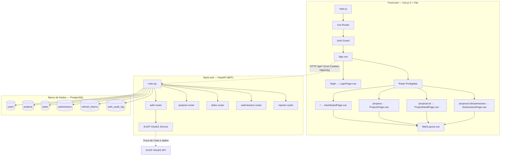

# 🏫 IFAL Projetos — Gestão de Projetos Acadêmicos

Este repositório contém a implementação do **IFAL Projetos**, uma plataforma web projetada para centralizar e otimizar a gestão de projetos integradores e Trabalhos de Conclusão de Curso (TCC) no Instituto Federal de Alagoas (IFAL). 

A plataforma oferece acompanhamento em tempo real das etapas de projetos acadêmicos através de quadros Kanban, versionamento de entregas de documentos e relatórios inteligentes.

---

## 1. Apresentação do Projeto

### 1.1 O Problema e sua Importância
No ambiente acadêmico, discentes, docentes orientadores e coordenadores frequentemente enfrentam dificuldades de organização e acompanhamento em projetos de longa duração. A ausência de uma ferramenta centralizada resulta em perda de prazos, descentralização das comunicações (e-mails, mensagens, arquivos perdidos) e falta de rastreabilidade histórica sobre a evolução do projeto e os feedbacks do orientador.
O **IFAL Projetos** resolve esse problema ao consolidar todas as tarefas, entregas de arquivos, links de repositórios Git externos e comunicações em uma única plataforma web integrada ao sistema de autenticação institucional (SUAP).

### 1.2 Escopo do Projeto
*   **O que está incluído:**
    *   Autenticação segura via SUAP OAuth2 utilizando fluxo Backend-For-Frontend (BFF).
    *   Gestão de perfis com permissões específicas (Aluno, Orientador, Coordenador, Administrador).
    *   Criação e edição de projetos com vinculação de equipes (alunos) e professor orientador.
    *   Quadro Kanban interativo para gerenciamento de tarefas (A Fazer, Em Progresso, Concluído) com atribuição de responsáveis e prazos.
    *   Histórico e controle de versões de entregas de arquivos (com limite de 50 MB) e download dos artefatos.
    *   Vinculação de URL de repositórios Git externos (GitHub, GitLab, etc.).
    *   Geração automática de relatórios de progresso em Markdown utilizando IA externa.
*   **O que está excluído (Versão 1.0):**
    *   Integração direta com APIs do GitHub/GitLab para leitura de commits.
    *   Sistemas de pagamento de taxas ou bolsas acadêmicas.
    *   Aplicativo móvel nativo (a interface web é responsiva).
*   **Limitações conhecidas:**
    *   A geração de relatórios com IA depende da disponibilidade de API de terceiros (fallback manual incluído).
    *   O upload de arquivos está limitado a 50 MB por envio.

---

## 2. Arquitetura do Sistema e Fluxo de Dados

A aplicação é dividida em três camadas principais: Front-end (Vue.js), Back-end (FastAPI atuando como BFF) e Banco de Dados (PostgreSQL). A autenticação é delegada ao SUAP via OAuth2.

### 2.1 Diagrama de Componentes (Arquitetura)



### 2.2 Camadas da Aplicação e Tecnologias Integradas
*   **Front-end (Cliente):** Desenvolvido em **Vue.js 3** estruturado com **Vite** para build rápido. O estado global é gerenciado com **Pinia** e a estilização é feita puramente em **Vanilla CSS** modular, garantindo performance e controle estético total sem dependência de Tailwind ou frameworks UI prontos.
*   **Back-end (Servidor):** Desenvolvido em **FastAPI (Python 3.11)** utilizando operações assíncronas. Ele atua como um **Backend-For-Frontend (BFF)**, intermediando a comunicação com o SUAP e blindando o cliente de chaves e tokens de acesso sensíveis.
*   **Banco de Dados (Persistência):** Banco de dados relacional **PostgreSQL** orquestrado via Docker. O ORM utilizado é o **SQLAlchemy (async)** e a evolução do esquema é gerenciada por migrações do **Alembic**.

---

## 3. Descrição de Dependências

### 3.1 Backend
As dependências do backend são gerenciadas através do padrão modernizado **PEP 621** no arquivo `backend/pyproject.toml`:
*   `fastapi`: Framework web para criação da API.
*   `uvicorn[standard]`: Servidor ASGI para rodar a aplicação.
*   `sqlalchemy[asyncio]`: ORM assíncrono para mapeamento de dados.
*   `alembic`: Ferramenta de versionamento e migrações do banco.
*   `asyncpg`: Driver assíncrono para conexão com o PostgreSQL.
*   `pyjwt[crypto]`: Biblioteca para geração e assinatura do JWT local.
*   `httpx`: Cliente HTTP assíncrono para realizar requisições ao SUAP.
*   `pytest` e `pytest-asyncio`: Bibliotecas para testes de integração assíncronos.

### 3.2 Frontend
As dependências do frontend são definidas em `frontend/package.json`:
*   `vue`: Framework JavaScript reativo.
*   `vue-router`: Gerenciamento de rotas e guards de navegação.
*   `pinia`: Gerenciador de estado global (auth store).
*   `vite`: Build-tool e servidor de desenvolvimento ágil.

---

## 4. Instruções de Instalação e Setup Local

### 4.1 Pré-requisitos
Certifique-se de ter instalado em sua máquina:
*   [Docker](https://docs.docker.com/get-docker/)
*   [Docker Compose](https://docs.docker.com/compose/install/)
*   [Git](https://git-scm.com/)

---

### 4.2 Rodando o Projeto via Docker (Método Recomendado)

A infraestrutura completa (Banco de Dados, Backend FastAPI e Frontend Vue/Nginx) pode ser instanciada localmente com um único comando:

1.  **Clonar o Repositório:**
    ```bash
    git clone <url-do-repositorio>
    cd Projeto-4-Bimestre
    ```

2.  **Configurar Variáveis de Ambiente:**
    Copie o arquivo de exemplo para a raiz e ajuste os valores se necessário:
    ```bash
    cp .env.example .env
    ```
    *Nota: O arquivo `.env` contém credenciais de acesso ao PostgreSQL e chaves de integração do SUAP OAuth2.*

3.  **Subir a Aplicação:**
    ```bash
    docker compose up --build
    ```

4.  **Acessar a Aplicação:**
    Abra seu navegador e acesse:
    *   **Frontend (Interface):** [http://localhost](http://localhost) (Porta 80 via Nginx)
    *   **Backend (Swagger/Docs):** [http://localhost:8000/docs](http://localhost:8000/docs) (FastAPI Swagger)
    *   **Banco de Dados:** Porta `25432` no host local.

---

### 4.3 Rodando Manualmente para Desenvolvimento (Sem Docker)

Se preferir rodar os serviços separadamente para debug ou desenvolvimento local:

#### Backend
1.  Navegue até a pasta `backend/`:
    ```bash
    cd backend
    ```
2.  Crie e ative um ambiente virtual Python:
    ```bash
    python -m venv venv
    source venv/bin/activate  # No Windows: venv\Scripts\activate
    ```
3.  Instale as dependências:
    ```bash
    pip install -e .[test]
    ```
4.  Certifique-se de que possui uma instância do PostgreSQL rodando localmente na porta configurada no seu `.env`.
5.  Execute as migrações do banco com o Alembic:
    ```bash
    alembic upgrade head
    ```
6.  Inicie o servidor de desenvolvimento:
    ```bash
    uvicorn app.main:app --reload
    ```

#### Frontend
1.  Navegue até a pasta `frontend/`:
    ```bash
    cd ../frontend
    ```
2.  Instale as dependências do Node:
    ```bash
    npm install
    ```
3.  Inicie o servidor de desenvolvimento do Vite com proxy habilitado para o backend:
    ```bash
    npm run dev
    ```
    *A interface estará disponível na porta `5173`.*

---

## 5. Executando a Suíte de Testes do Backend

Os testes cobrem a integridade dos fluxos de autenticação, geração de sessões locais e auditorias.

Para rodar os testes utilizando o ambiente Docker:
```bash
docker compose run --rm backend pytest
```

Para rodar os testes localmente (com o ambiente virtual ativo no backend):
```bash
pytest
```

---

## 6. Estrutura de Diretórios e Documentação

O repositório segue a estrutura organizacional abaixo:
*   `/docker` - Arquivos de configuração de imagem do Docker (`backend.Dockerfile`, `frontend.Dockerfile`).
*   `/docs` - Documentação de engenharia de software e especificações do projeto:
    *   [Documento de Visão RUP](./docs/documento_de_visao.md) (Casos de uso, requisitos e histórias de usuário).
    *   [Mini-spec de Autenticação SUAP](./docs/Mini-spec_Login.md) (Detalhes do BFF de Login).
    *   [Plano de Implementação](./docs/implementation_plan.md) (Roadmap das Fases 0 a 5).
    *   [Equipe de Desenvolvimento](./docs/equipe.md) (Responsabilidades e Fluxo Git).
    *   [Relatório de Handover](./docs/session_handover.md) (Resumo de transição técnica).
*   `/backend` - Código-fonte da API em FastAPI e scripts de migração do banco de dados.
*   `/frontend` - Código-fonte do cliente em Vue.js 3 e Nginx.
*   `docker-compose.yml` - Orquestrador de serviços locais.
*   `criteriodeentrega.txt` - Especificações de avaliação da entrega.
