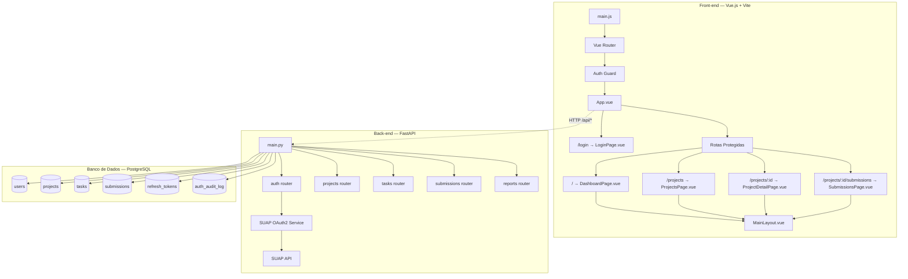

# 📋 SDD — IFAL Projetos: Plano de Implementação

> **Projeto:** IFAL Projetos — Gestão Acadêmica
> **Stack Front-end:** Vue.js 3 + Vite + Vanilla CSS
> **Stack Back-end:** FastAPI (Python 3.11) + PostgreSQL
> **Autenticação:** OAuth2 via SUAP (Backend-For-Frontend)
> **Atualizado em:** 02/06/2026

---

## 1. Arquitetura Geral

### 1.1 Visão Macro — Backend-For-Frontend (BFF)

```
[ Front-end: Vue.js ] ──(1. Redireciona)──► [ Tela de Login do SUAP ]
        ▲                                              │
        │                                         (2. Autoriza e retorna Code)
        │                                              ▼
        └──(4. Recebe JWT Próprio)◄── [ Back-end: FastAPI ] ◄──(3. Troca Code por Token do SUAP)
```

O front-end **nunca** se comunica diretamente com o SUAP. Toda interação é intermediada pelo FastAPI, que:
1. Gera a URL de autorização do SUAP e redireciona o usuário
2. Recebe o `authorization_code` via callback
3. Troca o code por um access token do SUAP (server-side)
4. Consulta os dados do usuário na API do SUAP
5. Cria/atualiza o usuário local no PostgreSQL
6. Emite um JWT próprio da aplicação para o front-end

### 1.2 Diagrama de Componentes



---

## 2. Lições do Projeto Anterior

> [!CAUTION]
> O código-fonte anterior (React + Express) foi **descartado integralmente**. Os problemas abaixo servem como guia do que **não** repetir.

| # | Problema | Lição para a nova stack |
|---|----------|------------------------|
| P1 | Classes utilitárias inline sem framework | Usar Vanilla CSS com classes semânticas e `<style scoped>` |
| P2 | Definições CSS duplicadas | Modularizar CSS por componente Vue |
| P3 | Todos os serviços eram mocks estáticos | Implementar API real desde o início com FastAPI |
| P4 | Sessão via localStorage | Usar cookies `httpOnly` + JWT server-side |
| P5 | Sem auditoria de login | Registrar eventos de autenticação desde a Fase 0 |
| P6 | Kanban sem funcionalidade real | Implementar funcionalidade antes de polir visual |
| P7 | Sem CRUD de projetos/submissões | Priorizar CRUD completo nas Fases 1–2 |

---

## 3. Decisões Arquiteturais

> [!IMPORTANT]
> ### D1 — Vanilla CSS (sem Tailwind)
> Seguir exclusivamente com **Vanilla CSS** modular. Componentes Vue usarão `<style scoped>` para estilos locais e `variables.css` para design tokens.

> [!IMPORTANT]
> ### D2 — Autenticação via SUAP (OAuth2 — BFF)
> A autenticação é feita **exclusivamente via SUAP**, usando o padrão Backend-For-Frontend. O front-end redireciona para o SUAP; o FastAPI recebe o `authorization_code`, troca pelo token, consulta dados do usuário e emite um JWT próprio. **Não há cadastro local de senhas, nem fluxos de `forgot-password` ou `reset-password`.** Usuários são criados automaticamente no primeiro login. Detalhes na [Mini-spec de Login](./Mini-spec_Login.md).

> [!IMPORTANT]
> ### D3 — Stack de Backend
> Backend com **FastAPI (Python) + PostgreSQL**, usando **SQLAlchemy async** como ORM e **Alembic** para migrations. FastAPI oferece documentação automática (Swagger/OpenAPI), suporte a async e tipagem forte com Pydantic.

> [!IMPORTANT]
> ### D4 — Infraestrutura com Docker e pyproject.toml
> O projeto usa **Docker** para garantir paridade entre ambientes de desenvolvimento e produção. O backend utiliza **`pyproject.toml`** (PEP 621) como fonte única de metadados e dependências, eliminando `requirements.txt` e `setup.py` separados.
>
> **Dockerfiles:**
> - **`backend.Dockerfile`** — Multi-stage build: *stage builder* instala deps via `pyproject.toml` em venv isolada; *stage runtime* copia apenas venv + código em imagem slim
> - **`frontend.Dockerfile`** — Build Vue.js + Vite com Nginx para servir assets estáticos
> - **`docker-compose.yml`** — Orquestra `backend`, `frontend`, `postgres` e volume persistente

> [!IMPORTANT]
> ### D5 — Estratégia de Sessão e Tokens (RNF004)
> Sessão **não** utiliza `localStorage` nem `sessionStorage`.
>
> | Componente | Tipo | TTL | Armazenamento |
> |-----------|------|-----|---------------|
> | **Access Token** | JWT assinado (HS256) | 15 minutos | Cookie `httpOnly`, `Secure`, `SameSite=Lax` |
> | **Refresh Token** | UUID opaco | 30 min sliding window | Tabela `refresh_tokens` no PostgreSQL |
>
> Fluxo de renovação: se o JWT expirou mas o refresh token está dentro da janela de 30 min, novo JWT é emitido automaticamente. Fora da janela → `HTTP 401` → redirect para `/login`.

> [!IMPORTANT]
> ### D6 — Perfis e Controle de Acesso (RF008)
>
> | Perfil | Role (enum) | Permissões |
> |--------|-------------|------------|
> | Administrador | `admin` | Acesso total: configuração, auditoria, gestão de usuários |
> | Coordenador | `coordinator` | Relatórios consolidados, supervisão de projetos do curso |
> | Orientador | `advisor` | Acompanhamento de tarefas, feedback e avaliação de entregas |
> | Aluno | `student` | Gestão do próprio projeto, Kanban, entregas e repositórios |
>
> O mapeamento de perfil SUAP → role local é feito via tipo de vínculo retornado pela API do SUAP.

---

## 4. Modelo de Dados

### Tabela `users`
```sql
CREATE TABLE users (
    id         UUID PRIMARY KEY DEFAULT gen_random_uuid(),
    suap_id    VARCHAR(50) UNIQUE NOT NULL,
    name       VARCHAR(255) NOT NULL,
    email      VARCHAR(255) UNIQUE NOT NULL,
    role       VARCHAR(20) NOT NULL CHECK (role IN ('admin', 'coordinator', 'advisor', 'student')),
    avatar_url VARCHAR(500),
    is_active  BOOLEAN DEFAULT TRUE,
    created_at TIMESTAMPTZ DEFAULT NOW(),
    updated_at TIMESTAMPTZ DEFAULT NOW()
);
CREATE INDEX idx_users_suap_id ON users(suap_id);
CREATE INDEX idx_users_email ON users(email);
CREATE INDEX idx_users_role ON users(role);
```

### Tabela `refresh_tokens`
```sql
CREATE TABLE refresh_tokens (
    id         UUID PRIMARY KEY DEFAULT gen_random_uuid(),
    user_id    UUID NOT NULL REFERENCES users(id) ON DELETE CASCADE,
    token      VARCHAR(255) UNIQUE NOT NULL,
    expires_at TIMESTAMPTZ NOT NULL,
    created_at TIMESTAMPTZ DEFAULT NOW()
);
CREATE INDEX idx_refresh_tokens_user ON refresh_tokens(user_id);
CREATE INDEX idx_refresh_tokens_token ON refresh_tokens(token);
```

### Tabela `auth_audit_log`
```sql
CREATE TABLE auth_audit_log (
    id         BIGSERIAL PRIMARY KEY,
    user_id    UUID REFERENCES users(id),
    email      VARCHAR(255) NOT NULL,
    action     VARCHAR(30) NOT NULL CHECK (action IN (
        'login_success', 'login_failure', 'logout', 'token_refresh'
    )),
    ip_address INET,
    user_agent TEXT,
    metadata   JSONB,
    created_at TIMESTAMPTZ DEFAULT NOW()
);
CREATE INDEX idx_auth_audit_user    ON auth_audit_log(user_id);
CREATE INDEX idx_auth_audit_action  ON auth_audit_log(action);
CREATE INDEX idx_auth_audit_created ON auth_audit_log(created_at);
```

> As tabelas `projects`, `tasks`, `submissions` serão definidas na Fase 2.

---

## 5. Especificação da API de Autenticação

| Método | Rota | Auth | Descrição |
|--------|------|------|-----------|
| `GET` | `/api/auth/authorize` | Público | Redireciona para o SUAP com parâmetros OAuth2 |
| `GET` | `/api/auth/callback` | Público | Recebe `code`, troca por token SUAP, emite JWT |
| `GET` | `/api/auth/me` | JWT | Retorna dados do usuário logado |
| `POST` | `/api/auth/logout` | JWT | Invalida sessão e limpa cookies |
| `POST` | `/api/auth/refresh` | Cookie | Renova access token via refresh token |

### Contratos relevantes

**`GET /api/auth/callback` — sucesso:** `302` redirect para `/` com `Set-Cookie` contendo o JWT `httpOnly`.

**`GET /api/auth/callback` — falha:**
```json
{ "error": "INVALID_CODE", "message": "Código de autorização inválido ou expirado." }
```

**`GET /api/auth/me` — sucesso:**
```json
{
  "user": {
    "id": "uuid",
    "name": "Nome Completo",
    "email": "aluno@ifal.edu.br",
    "role": "student",
    "suap_id": "12345",
    "avatar_url": "https://suap.ifal.edu.br/media/..."
  }
}
```

---

## 6. Plano de Ação

### ✅ Fase 0 — Infraestrutura, Backend e Autenticação SUAP *(Concluída)*

| Tarefa | Descrição | Status | Arquivo(s) |
|--------|-----------|:------:|------------|
| Inicializar projeto FastAPI | Estrutura de pastas, `main.py`, `pyproject.toml` (PEP 621) | ✅ | `backend/app/main.py`, `backend/pyproject.toml` |
| Criar `backend.Dockerfile` | Multi-stage build: builder → runtime (slim + venv) | ✅ | `backend/backend.Dockerfile` |
| Criar `frontend.Dockerfile` | Build Vue.js + Vite → Nginx para servir assets | ✅ | `frontend/frontend.Dockerfile` |
| Criar `docker-compose.yml` | Orquestração: `backend`, `frontend`, `postgres`, volumes | ✅ | `docker-compose.yml` |
| Configurar infraestrutura de testes | `pytest`, `pytest-asyncio` e `httpx`; `tests/conftest.py` | ✅ | `backend/tests/conftest.py`, `backend/pyproject.toml` |
| Configurar PostgreSQL | SQLAlchemy async engine + Alembic | ✅ | `backend/app/database.py`, `backend/alembic.ini` |
| Criar models e migrations | Tabelas `users`, `refresh_tokens`, `auth_audit_log` | ✅ | `backend/app/models.py`, `backend/migrations/` |
| Implementar `GET /api/auth/authorize` | Gera URL OAuth2 SUAP e retorna redirect 302 | ✅ | `backend/app/routers/auth.py` |
| Implementar `GET /api/auth/callback` | Troca code, persiste user, emite JWT em cookie `httpOnly` | ✅ | `backend/app/routers/auth.py` |
| Implementar `GET /api/auth/me` | Retorna dados via `Depends(get_current_user)` | ✅ | `backend/app/routers/auth.py` |
| Implementar `POST /api/auth/logout` | Invalida refresh token e limpa cookies | ✅ | `backend/app/routers/auth.py` |
| Implementar `POST /api/auth/refresh` | Valida refresh token, emite novo JWT (sliding window 30 min) | ✅ | `backend/app/routers/auth.py` |
| Middleware de autenticação | `Depends(get_current_user)` — retorna `401` se inválido | ✅ | `backend/app/auth_utils.py` |
| Logging de auditoria | `log_auth_event()` grava em `auth_audit_log` | ✅ | `backend/app/auth_utils.py` |
| Testes de integração da API | 7 testes cobrindo todos os endpoints de auth | ✅ | `backend/tests/test_auth.py` |

> **Resultado dos Testes:** `7 passed, 3 warnings in 0.94s`

---

### ✅ Fase 1 — Front-end Base + Integração Auth *(Concluída)*

| Tarefa | Descrição | Status | Arquivo(s) |
|--------|-----------|:------:|------------|
| Inicializar Vue.js + Vite | Vue Router 4 + Pinia | ✅ | `frontend/package.json`, `frontend/index.html`, `frontend/src/main.js` |
| Proxy do Vite | `/api/*` → `http://localhost:8000` em dev | ✅ | `frontend/vite.config.js` |
| Layout base | Grid principal com sidebar + header + conteúdo | ✅ | `frontend/src/layouts/MainLayout.vue` |
| Componentes globais | Header com breadcrumbs e avatar; Sidebar com navegação | ✅ | `frontend/src/components/AppHeader.vue`, `frontend/src/components/SidebarNav.vue` |
| Sistema de estilos | Tokens de cor, tipografia, glassmorphism e utilitários | ✅ | `frontend/src/assets/variables.css`, `frontend/src/assets/global.css` |
| Auth store (Pinia) | Estado `user`/`isAuthenticated`; ações `fetchUser()`/`logout()`/`login()` | ✅ | `frontend/src/store/auth.js` |
| Auth guard | `router.beforeEach` → redirect `/login` se não autenticado | ✅ | `frontend/src/router/index.js` |
| Página de Login | Glassmorphism, orbs animados, botão SUAP | ✅ | `frontend/src/views/LoginPage.vue` |
| Dashboard | Stat-cards, banner personalizado, métricas mock | ✅ | `frontend/src/views/DashboardPage.vue` |
| Views base (cascas) | Estrutura de grid e listas para as próximas fases | ✅ | `frontend/src/views/ProjectsPage.vue`, `frontend/src/views/ProjectDetailPage.vue`, `frontend/src/views/SubmissionsPage.vue` |
| Componente raiz | Instancia Pinia, Router e CSS | ✅ | `frontend/src/App.vue` |

---

### ✅ Fase 2 — CRUD de Projetos e Tarefas (RF001–RF004, RF007, RF008) *(Concluída)*

| Tarefa | Descrição | Status |
|--------|-----------|:------:|
| Models + migrations de projetos e tarefas | Tabelas `projects` (título, descrição, `repository_url`, membros) e `tasks` (status, responsável, prazo) | ✅ |
| `GET/POST/PUT/DELETE /api/projects` | CRUD completo; `POST` e `DELETE` restritos a `advisor` e acima | ✅ |
| `GET/POST/PUT/DELETE /api/tasks` | CRUD com campo `status`: `todo` / `in_progress` / `done` | ✅ |
| `PATCH /api/tasks/:id/status` | Movimentação de status (Kanban drag-and-drop) | ✅ |
| Middleware de perfil | `Depends(require_role(...))` no FastAPI; guards Vue ocultam ações não permitidas por role | ✅ |
| `ProjectsPage.vue` | Listagem com cards de projeto (substituir casca atual) | ✅ |
| `ProjectDetailPage.vue` | Detalhes do projeto + quadro Kanban com três colunas | ✅ |
| Quadro Kanban | Colunas A Fazer / Em Progresso / Concluído; movimentação por botão ou drag-and-drop | ✅ |
| Controle de acesso por perfil | Middleware FastAPI verifica `user.role`; guards Vue ocultam ações não permitidas | ✅ |
| Responsividade das Views | Garantir que o grid principal, a listagem de projetos e o quadro Kanban adaptem-se a telas mobile e tablets | ✅ |

---

### 🔲 Fase 3 — Entregas e Submissões (RF005, RF006, RF011)

| Tarefa | Descrição | Status |
|--------|-----------|:------:|
| Model + migration `submissions` | Campos: `project_id`, `version` (auto-incremental), `file_path`, `uploader_id`, `feedback`, `status` (`pending` / `evaluated`) | 🔲 |
| `POST /api/submissions` | Upload de arquivo (limite 50 MB — RNF009) + gera versão incremental | 🔲 |
| `GET /api/submissions/:project_id` | Lista histórico de versões com data, autor e número de versão | 🔲 |
| `GET /api/submissions/:id/download` | Serve o arquivo para download | 🔲 |
| `PATCH /api/submissions/:id/evaluate` | Salva `feedback` textual e muda status para `evaluated`; restrito a `advisor` | 🔲 |
| `SubmissionsPage.vue` | Lista de entregas + formulário de upload + histórico de versões (substituir casca atual) | 🔲 |
| Vinculação Git (RF007) | Campo `repository_url` em `projects`; exibido no `ProjectDetailPage.vue` | 🔲 |
| Hospedagem na AWS | Configurar deploy da aplicação na AWS usando imagens Docker (Backend, Frontend, PostgreSQL) | 🔲 |
| Guia de Deploy | Escrever instruções detalhadas de deploy e infraestrutura em nuvem na documentação | 🔲 |

---

### 🔲 Fase 4 — Estética Premium

| Tarefa | Descrição | Status |
|--------|-----------|:------:|
| Redesign do Header | Avatar do SUAP, breadcrumbs dinâmicos, campo de busca | 🔲 |
| Dashboard com métricas | Stat cards: projetos ativos, tarefas pendentes, entregas recentes | 🔲 |
| Animações | `<Transition>` e `<TransitionGroup>` do Vue; fade/slide nas trocas de rota | 🔲 |
| Empty states | Ilustrações SVG inline para listas vazias | 🔲 |
| Toast/notificações | Componente global via Pinia; auto-dismiss em 4s; usado também para feedback de erros de auth (RF-L03) | 🔲 |

---

### 🔲 Fase 5 — Polimento Final

| Tarefa | Descrição | Status |
|--------|-----------|:------:|
| Skeleton loaders | Componente `SkeletonCard.vue` para listas em carregamento | 🔲 |
| Responsividade | Polimento e ajustes finos de responsividade geral nas demais views do sistema | 🔲 |
| Microanimações | `:hover` e `:focus-visible` com `transition` em CSS | 🔲 |
| SEO | `useHead` por rota com meta `title` e `description` | 🔲 |
| Relatórios com IA (RF010) | `POST /api/reports/generate` → monta prompt com dados do projeto → chama API externa de LLM → retorna Markdown renderizável | 🔲 |

---

## 7. Verificação

### Testes Automatizados — Backend (Pytest)

| Endpoint | Cenário | Esperado |
|----------|---------|----------|
| `GET /api/auth/authorize` | — | Redirect 302 para URL do SUAP com parâmetros OAuth2 |
| `GET /api/auth/callback` | `code` válido | Cookie `httpOnly` com JWT + usuário criado no banco |
| `GET /api/auth/callback` | `code` inválido | HTTP 401 com `INVALID_CODE` |
| `GET /api/auth/me` | Sessão ativa | JSON com dados do usuário |
| `GET /api/auth/me` | Sem sessão | HTTP 401 com `UNAUTHORIZED` |
| `POST /api/auth/logout` | — | Cookie removido + refresh token invalidado no banco |
| `POST /api/auth/refresh` | Token dentro da janela | Novo JWT emitido + refresh token renovado |
| `POST /api/auth/refresh` | Token expirado (> 30 min) | HTTP 401 |
| Auditoria | Qualquer ação de auth | Registro gravado em `auth_audit_log` com `user_id`, `ip_address`, `action` |

### Testes Manuais — Front-end

- Login/logout via SUAP com cada perfil (`student`, `advisor`, `coordinator`, `admin`)
- Acesso direto a rota protegida sem sessão → redirect para `/login`
- Expiração de token durante navegação → redirect automático sem perda de contexto
- Responsividade em mobile (< 768px) e tablet (< 1024px)
- Console do browser sem erros durante todo o fluxo

### Testes de Integração Front-end ↔ Backend

- Login completo via SUAP → auth store recebe dados do `GET /api/auth/me`
- Expiração de access token → refresh automático transparente para o usuário
- Expiração do refresh token → redirect para `/login`
- Acesso sem login a rota protegida → redirect para `/login`
