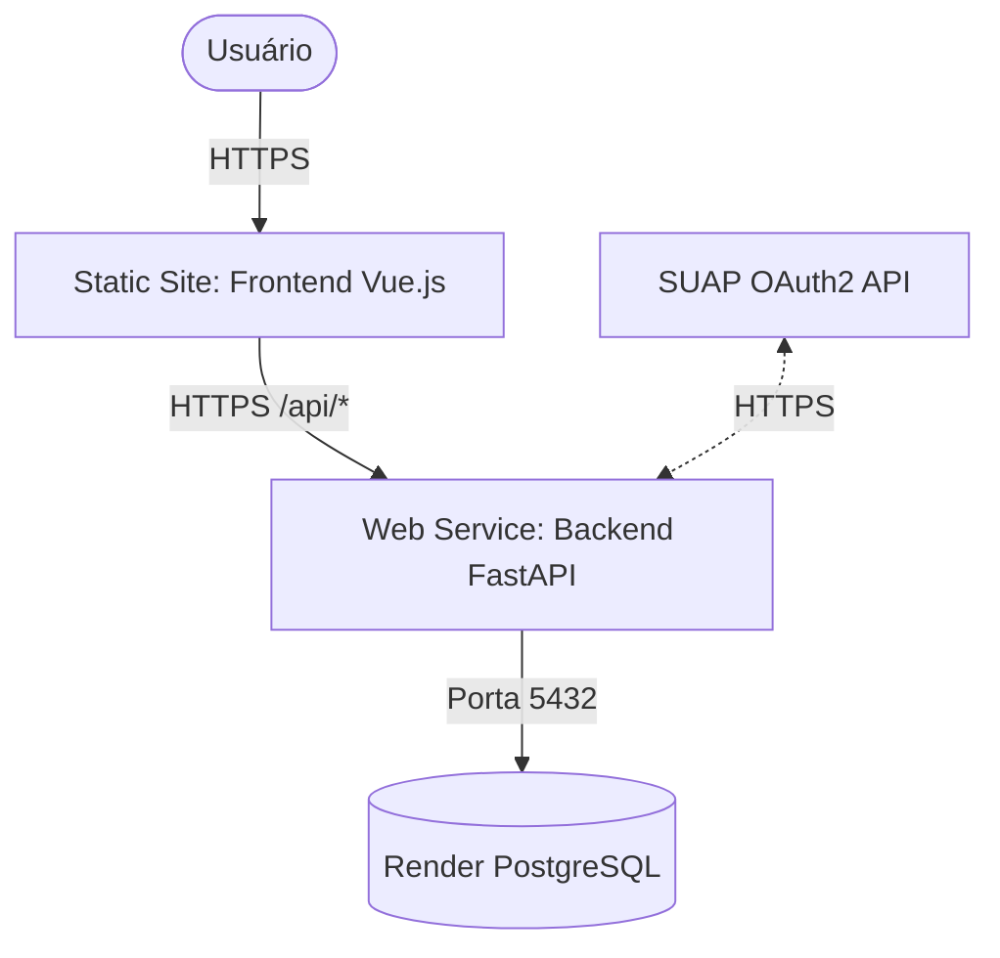

# 🚀 Guia de Deploy na Render — IFAL Projetos

Este guia detalha o processo completo para publicar a aplicação **IFAL Projetos** (Frontend Vue.js + Backend FastAPI + PostgreSQL) na plataforma [Render](https://render.com), de forma **gratuita** e com **HTTPS automático**.

---

## 📌 1. Pré-requisitos

- Conta no [Render](https://dashboard.render.com/register) (plano gratuito é suficiente).
- Repositório hospedado no GitHub ou GitLab.
- Credenciais do SUAP OAuth2 (`SUAP_CLIENT_ID`, `SUAP_CLIENT_SECRET`) — obtidas no painel de APIs do SUAP.

---

## 🏗️ 2. Arquitetura no Render

A aplicação será dividida em **3 serviços independentes** no Render:



| Serviço | Tipo no Render | Plano | Tecnologia |
|---------|---------------|-------|------------|
| **Banco de Dados** | PostgreSQL | Free | PostgreSQL 16 |
| **Backend** | Web Service (Docker) | Free | FastAPI + Uvicorn |
| **Frontend** | Static Site | Free | Vue.js 3 + Vite |

> [!NOTE]
> O plano gratuito do Render possui as seguintes limitações:
> - **Web Services** "adormecem" após 15 minutos de inatividade (cold start de ~30s na próxima requisição).
> - **PostgreSQL Free** expira após 90 dias (será necessário recriar o banco).
> - Para uso acadêmico e demonstrações, estas limitações são aceitáveis.

---

## ⚡ 3. Deploy Automático via Blueprint (Recomendado)

O repositório já contém um arquivo [`render.yaml`](../render.yaml) que define toda a infraestrutura como código. Este é o método mais rápido.

### Passo 1: Conectar o Repositório

1. Acesse o [Dashboard do Render](https://dashboard.render.com).
2. Navegue até **Blueprints** > **New Blueprint Instance**.
3. Conecte sua conta GitHub/GitLab e selecione o repositório `Projeto-4-Bimestre`.
4. O Render detectará automaticamente o `render.yaml` na raiz do projeto.

### Passo 2: Revisar e Aplicar o Blueprint

1. O Render exibirá os 3 serviços que serão criados (Database, Backend, Frontend).
2. Revise os nomes e clique em **Apply**.
3. Aguarde o provisionamento (leva alguns minutos).

### Passo 3: Configurar Variáveis de Ambiente

Após o deploy inicial, configure as variáveis marcadas como `sync: false` no Dashboard:

1. **Backend** (`ifal-projetos-backend` > Environment):
   | Variável | Valor |
   |----------|-------|
   | `SUAP_CLIENT_ID` | Seu Client ID do SUAP |
   | `SUAP_CLIENT_SECRET` | Seu Client Secret do SUAP |
   | `SUAP_REDIRECT_URI` | `https://ifal-projetos-backend.onrender.com/api/auth/callback` |
   | `CORS_ALLOWED_ORIGINS` | `https://ifal-projetos-frontend.onrender.com` |

   > *Nota: `DATABASE_URL` e `JWT_SECRET` são configurados automaticamente pelo Blueprint.*

2. **Frontend** (`ifal-projetos-frontend` > Environment):
   | Variável | Valor |
   |----------|-------|
   | `VITE_API_BASE_URL` | `https://ifal-projetos-backend.onrender.com` |

### Passo 4: Executar Migrações do Banco

Após o primeiro deploy do backend, execute as migrações do Alembic:

1. No Dashboard do Render, vá até o serviço **ifal-projetos-backend**.
2. Acesse a aba **Shell**.
3. Execute:
   ```bash
   alembic upgrade head
   ```

### Passo 5: Verificar o Deploy

- **Frontend:** `https://ifal-projetos-frontend.onrender.com`
- **Backend (Swagger):** `https://ifal-projetos-backend.onrender.com/docs`
- **Health Check:** `https://ifal-projetos-backend.onrender.com/api/health`

---

## 🔧 4. Deploy Manual via Dashboard (Alternativa)

Se preferir criar os serviços individualmente sem usar o Blueprint:

### 4.1 Criar o Banco de Dados PostgreSQL

1. No Dashboard, clique em **New** > **PostgreSQL**.
2. Configure:
   - **Name:** `ifal-projetos-db`
   - **Database:** `ifal_projetos`
   - **User:** `ifal_user`
   - **Region:** Oregon (US West)
   - **Plan:** Free
3. Clique em **Create Database**.
4. Após a criação, copie a **Internal Database URL** (será usada pelo backend).

### 4.2 Criar o Backend (Web Service)

1. Clique em **New** > **Web Service**.
2. Conecte o repositório.
3. Configure:
   - **Name:** `ifal-projetos-backend`
   - **Region:** Oregon
   - **Runtime:** Docker
   - **Docker file path:** `./docker/backend.Dockerfile`
   - **Docker context:** `./backend`
   - **Plan:** Free
4. Adicione as **variáveis de ambiente**:
   - `DATABASE_URL` = Internal Database URL copiada do passo 4.1
   - `JWT_SECRET` = Gerar com `openssl rand -hex 32`
   - `SUAP_CLIENT_ID`, `SUAP_CLIENT_SECRET`, `SUAP_REDIRECT_URI`
   - `CORS_ALLOWED_ORIGINS` = URL do frontend (configurar após deploy do frontend)
   - `ACCESS_TOKEN_EXPIRE_MINUTES` = `15`
   - `REFRESH_TOKEN_EXPIRE_MINUTES` = `30`
5. Configure o **Health Check Path:** `/api/health`
6. Clique em **Create Web Service**.

### 4.3 Criar o Frontend (Static Site)

1. Clique em **New** > **Static Site**.
2. Conecte o repositório.
3. Configure:
   - **Name:** `ifal-projetos-frontend`
   - **Build Command:** `cd frontend && npm install && npm run build`
   - **Publish Directory:** `frontend/dist`
4. Adicione a variável de ambiente:
   - `VITE_API_BASE_URL` = URL do backend (ex: `https://ifal-projetos-backend.onrender.com`)
5. Adicione a **Rewrite Rule**:
   - Source: `/*`
   - Destination: `/index.html`
   - Action: Rewrite
6. Clique em **Create Static Site**.

---

## 🔒 5. HTTPS e SUAP OAuth2

O Render fornece **certificados SSL gratuitos e automáticos** para todos os serviços, incluindo o plano Free. Isso significa que:

- ✅ Todos os URLs já são HTTPS por padrão.
- ✅ A `SUAP_REDIRECT_URI` pode usar `https://` sem configuração adicional.
- ✅ Os cookies `HttpOnly` e `Secure` funcionam corretamente.

> [!IMPORTANT]
> Lembre-se de registrar a `SUAP_REDIRECT_URI` no painel de APIs do SUAP como:
> `https://ifal-projetos-backend.onrender.com/api/auth/callback`

---

## 🔄 6. Deploy Contínuo (CI/CD)

O Render faz **deploy automático** a cada push na branch conectada:

1. No Dashboard do serviço, vá em **Settings** > **Build & Deploy**.
2. Defina a **Branch** para `main` (ou `feature/fase3-submissions` para testes).
3. A cada push, o Render:
   - Reconstrói a imagem Docker do backend.
   - Executa `npm run build` para o frontend.
   - Faz o deploy automaticamente.

> [!TIP]
> Para desabilitar o deploy automático, desmarque **Auto-Deploy** nas configurações e utilize **Manual Deploy** via botão no Dashboard.

---

## 📋 7. Tabela de Variáveis de Produção (Referência Completa)

| Variável | Serviço | Automático? | Descrição |
|----------|---------|:-----------:|-----------|
| `DATABASE_URL` | Backend | ✅ Blueprint | String de conexão do PostgreSQL |
| `JWT_SECRET` | Backend | ✅ Blueprint | Chave aleatória de assinatura JWT |
| `SUAP_CLIENT_ID` | Backend | ❌ Manual | Client ID registrado no SUAP |
| `SUAP_CLIENT_SECRET` | Backend | ❌ Manual | Client Secret registrado no SUAP |
| `SUAP_REDIRECT_URI` | Backend | ❌ Manual | URI de callback OAuth2 |
| `CORS_ALLOWED_ORIGINS` | Backend | ❌ Manual | URL do frontend na Render |
| `ACCESS_TOKEN_EXPIRE_MINUTES` | Backend | ✅ Blueprint | Tempo de expiração do access token |
| `REFRESH_TOKEN_EXPIRE_MINUTES` | Backend | ✅ Blueprint | Tempo de expiração do refresh token |
| `VITE_API_BASE_URL` | Frontend | ❌ Manual | URL do backend na Render |

---

## ⚠️ 8. Troubleshooting

### O backend não inicia
- Verifique os **Logs** no Dashboard do Render.
- Confirme que `DATABASE_URL` está configurado e acessível.
- Certifique-se de que a porta é dinâmica (`$PORT`) — o Dockerfile já está configurado para isso.

### Erros de CORS no frontend
- Verifique que `CORS_ALLOWED_ORIGINS` no backend contém a URL exata do frontend (incluindo `https://`).
- Não inclua barra final (`/`) na URL.

### Login com SUAP falha
- Confirme que `SUAP_REDIRECT_URI` está registrada no painel do SUAP **exatamente** como configurada na variável.
- Certifique-se de que o protocolo é `https://`.

### Banco de dados expirou (após 90 dias no Free)
- Crie um novo banco no Render.
- Atualize `DATABASE_URL` no backend.
- Execute `alembic upgrade head` via Shell.
