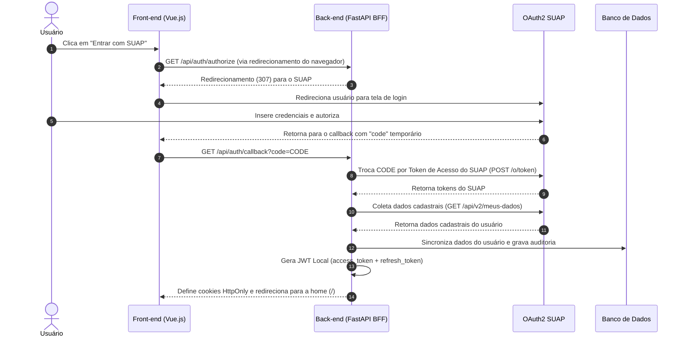

# Relatório de Transição e Handover — Fases 0 e 1 (Infraestrutura, BFF SUAP e Front-end Base)

Este relatório detalha a conclusão das **Fases 0 e 1** do plano de implementação da nova stack de tecnologia do projeto **IFAL Projetos**. O objetivo deste documento é orientar a equipe no entendimento da infraestrutura baseada em contêineres, nos mecanismos de autenticação com SUAP sob a arquitetura **BFF (Backend-For-Frontend)** e na estrutura inicial do front-end em Vue 3.

---

## 1. Contexto e Nova Stack Tecnológica

Seguindo as novas diretrizes técnicas definidas, toda a base antiga da aplicação foi descartada para dar lugar a uma stack moderna, robusta e escalável:

*   **Front-end:** Vue.js 3 + Vite (Estilização pura em **Vanilla CSS**).
*   **Back-end:** FastAPI (Python 3.11) assíncrono.
*   **Banco de Dados:** PostgreSQL (orquestrado via Docker).
*   **Gerenciamento de Migrações:** Alembic.
*   **Segurança/Autenticação:** Integração OAuth2 SUAP delegada com sessões baseadas em cookies HttpOnly geradas localmente.

---

## 2. Arquitetura de Autenticação (BFF com SUAP)

A autenticação é totalmente gerenciada no backend para evitar que o frontend armazene credenciais sensíveis ou tokens de terceiros. A estrutura do fluxo é a seguinte:



---

## 3. Entregáveis Concluídos (Fase 0 e Fase 1)

### ⚙️ Fase 0: Infraestrutura de Contêineres e Backend (100% Concluído)
*   **`backend/pyproject.toml`:** Configuração unificada do projeto seguindo a especificação **PEP 621** contendo dependências do FastAPI, SQLAlchemy Async, Alembic e biblioteca de testes (`pytest`, `pytest-asyncio`, `httpx` e `aiosqlite`).
*   **`backend/backend.Dockerfile`:** Dockerfile multi-stage extremamente otimizado.
*   **`docker-compose.yml`:** Orquestração completa dos serviços de banco (`db`), backend (`backend`) e frontend (`frontend`). 
*   **`backend/app/database.py` & `models.py`:** Mapeamento declarativo ORM das tabelas cruciais para segurança: `users`, `refresh_tokens` e `auth_audit_log` com migrações Alembic configuradas.
*   **Endpoints do BFF de Autenticação:**
    - `GET /api/auth/authorize` - Redireciona o usuário para o SUAP.
    - `GET /api/auth/callback` - Processa a validação do SUAP, persiste/atualiza dados cadastrais locais e emite cookies criptografados HttpOnly seguros `access_token` (15 min) e `refresh_token` (30 min).
    - `POST /api/auth/refresh` - Rotação e renovação silenciosa dos cookies de sessão.
    - `POST /api/auth/logout` - Limpa os cookies do navegador e remove tokens ativos do banco.
    - `GET /api/auth/me` - Retorna os dados do usuário atualmente logado.

### 🎨 Fase 1: Front-end Base e Integração Auth (100% Concluído)
*   **Inicialização do Vue 3 + Vite:** Projeto scaffoldado de forma limpa na pasta `frontend/` com gerenciamento de dependências (`vue-router` e `pinia`).
*   **Sistema de Estilos Premium (Vanilla CSS):**
    - `frontend/src/assets/variables.css`: Design tokens unificados com cores escuras modernas (Indigo/Violeta), glassmorphism e sombras refinadas.
    - `frontend/src/assets/global.css`: Estilização global com resets de margem, tipografia Outfit e Inter do Google Fonts, além de barras de rolagem customizadas.
*   **Roteamento Protegido (Vue Router):**
    - `frontend/src/router/index.js` configurado com lazy loading e **Route Guards** de autenticação. Usuários não autenticados que tentam acessar rotas privadas são redirecionados automaticamente para `/login`.
*   **Gerenciamento de Estado Global (Pinia):**
    - `frontend/src/store/auth.js` gerencia o estado da sessão do usuário, chamando de forma transparente os endpoints `/api/auth/me` e `/api/auth/logout` do BFF.
*   **Layouts e Componentes Globais:**
    - `MainLayout.vue`: Disposição em grid contendo animações de transição de rota.
    - `AppHeader.vue`: Exibição de breadcrumbs dinâmicos e avatar SUAP/iniciais com logout.
    - `SidebarNav.vue`: Menu lateral com links e hover com elevação tridimensional baseada nos cargos.
*   **Views Implementadas:**
    - `LoginPage.vue`: Design com glassmorphism sofisticado, glowing orbs no plano de fundo e botão de login SUAP integrado.
    - `DashboardPage.vue`: Exibição de dados de matrícula, e-mail, perfil e cards de métricas (projetos, tarefas e entregas) com transições no hover.
    - `ProjectsPage.vue`, `ProjectDetailPage.vue` e `SubmissionsPage.vue`: Estruturas de grid e listas responsivas preparadas para as próximas fases.

---

## 4. Estrutura Atual do Repositório

```text
Projeto-4-Bimestre/
├── .github/
│   └── workflows/
│       └── ci.yml                 # Pipeline de Integração Contínua (GitHub Actions)
├── backend/
│   ├── app/
│   │   ├── app/routers/
│   │   │   ├── __init__.py
│   │   │   └── auth.py             # Endpoints BFF e fluxo OAuth2 SUAP
│   │   ├── __init__.py
│   │   ├── auth_utils.py          # Utilitários de segurança e dependências de JWT
│   │   ├── config.py              # Centralização de variáveis e URLs do SUAP
│   │   ├── database.py            # Sessão assíncrona SQLAlchemy
│   │   ├── main.py                # Ponto de entrada FastAPI e setup CORS
│   │   ├── models.py              # Modelos ORM (User, RefreshToken, AuditLog)
│   │   └── schemas.py             # Schemas de dados Pydantic
│   ├── migrations/                # Scripts de migração do banco de dados (Alembic)
│   ├── tests/
│   │   ├── __init__.py
│   │   ├── conftest.py            # Fixtures de testes assíncronos e DB em memória
│   │   └── test_auth.py           # Testes automatizados de integração do fluxo auth
│   └── alembic.ini                # Configuração do utilitário Alembic
├── docker/
│   ├── backend.Dockerfile         # Dockerfile do backend
│   └── frontend.Dockerfile        # Dockerfile do frontend
├── docs/
│   ├── Mini-spec_Login.md         # Especificação conceitual detalhada do BFF
│   ├── documento_de_visao.md      # Documento de Visão RUP
│   ├── equipe.md                  # Equipe de desenvolvimento
│   ├── implementation_plan.md     # Documento com o roadmap do projeto
│   └── session_handover.md        # Este relatório
├── frontend/
│   ├── public/                    # Assets estáticos públicos do frontend
│   ├── src/
│   │   ├── assets/
│   │   │   ├── variables.css      # Tokens e variáveis CSS do tema
│   │   │   └── global.css         # Estilos globais e resets do projeto
│   │   ├── components/
│   │   │   ├── AppHeader.vue      # Header de navegação superior
│   │   │   └── SidebarNav.vue     # Menu lateral com links do painel
│   │   ├── layouts/
│   │   │   └── MainLayout.vue     # Layout principal envolvendo rotas privadas
│   │   ├── router/
│   │   │   └── index.js           # Roteamento e Route Guards
│   │   ├── store/
│   │   │   └── auth.js            # Store Pinia para autenticação
│   │   ├── views/
│   │   │   ├── LoginPage.vue      # Tela de login customizada com SUAP
│   │   │   ├── DashboardPage.vue  # Painel principal do usuário
│   │   │   ├── ProjectsPage.vue   # Grid de visualização de projetos
│   │   │   ├── ProjectDetailPage.vue # Visualização técnica dos projetos
│   │   │   └── SubmissionsPage.vue # Histórico e uploads de submissões
│   │   ├── App.vue                # Componente principal do Vue
│   │   └── main.js                # Inicializador do frontend Vue
│   ├── nginx.conf                 # Configuração do Nginx local
│   ├── package.json               # Dependências do frontend (vue-router, pinia, etc.)
│   ├── vite.config.js             # Configurações do Vite (Alias e Proxy)
│   └── index.html                 # Ponto de montagem HTML
├── .env                           # Credenciais locais de desenvolvimento (Não commitar!)
├── .env.example                   # Modelo explicativo de ambiente para a equipe
├── .gitignore                     # Proteção contra vazamento de credenciais e caches
├── docker-compose.yml             # Orquestrador local da infraestrutura
└── README.md                      # Instruções de setup e documentação inicial do projeto
```

---

## 5. Como Rodar o Projeto e Executar os Testes

### 🐳 Subindo a Infraestrutura Completa (Desenvolvimento)
Para subir o banco de dados PostgreSQL, o backend FastAPI e o frontend Vue integrados atrás do proxy Nginx:
1. Copie o arquivo de exemplo para configurar seu `.env`:
   ```bash
   cp .env.example .env
   ```
2. Suba os contêineres:
   ```bash
   docker compose up --build
   ```
A aplicação estará disponível em `http://localhost`. O backend redirecionará os fluxos de login para a porta `80` (onde o Nginx está escutando) garantindo o tráfego correto dos cookies de sessão.

### 🧪 Executando os Testes de Integração do Backend (`pytest`)
Para executar a suíte de testes de autenticação localmente dentro dos contêineres:
```bash
docker compose run --rm backend pytest
```
