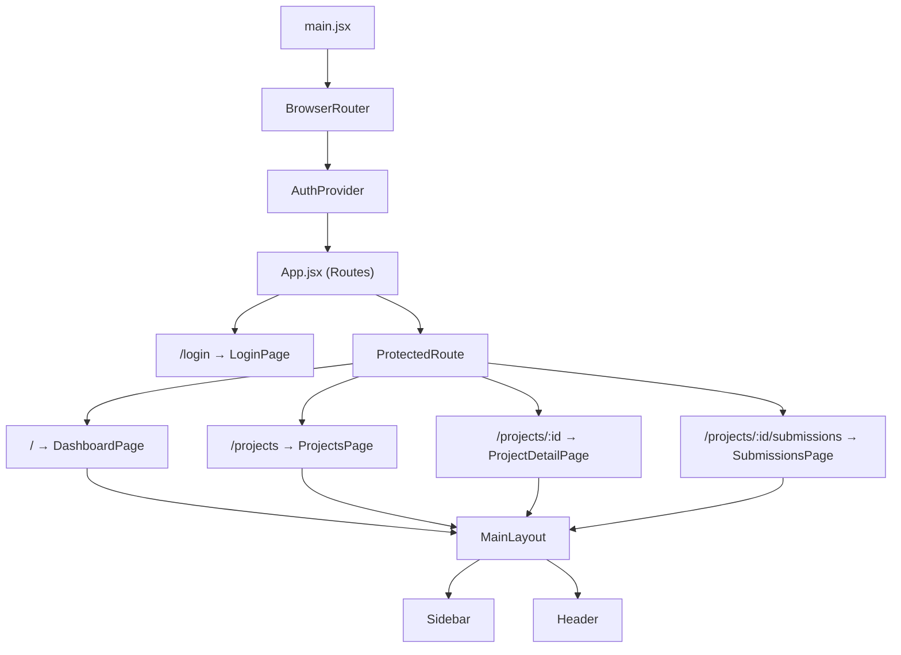

# 📋 SDD — IFAL Projetos: Relatório de Diagnóstico e Plano de Reestruturação

> **Projeto:** IFAL Projetos — Gestão Acadêmica  
> **Stack Front-end:** React 18 + Vite 5 + Vanilla CSS  
> **Stack Back-end:** Node.js 20 + Express 5 + PostgreSQL 16  
> **Data:** 13/05/2026  

---

## 1. Arquitetura Atual



### Inventário de Arquivos

| Camada | Arquivo | Linhas | Estado |
|--------|---------|--------|--------|
| **Pages** | LoginPage.jsx | 142 | ⚠️ Funcional, estética OK |
| | DashboardPage.jsx | 98 | ⚠️ Básico demais |
| | ProjectsPage.jsx | 72 | 🔴 Ausência de CSS Vanilla |
| | ProjectDetailPage.jsx | 134 | 🔴 Ausência de CSS Vanilla |
| | SubmissionsPage.jsx | 120 | ⚠️ Misto de classes utilitárias |
| **Layout** | MainLayout.jsx | 23 | ✅ OK |
| | Header.jsx | 17 | ⚠️ Minimalista demais |
| | Sidebar.jsx | 59 | ✅ Funcional |
| | ProtectedRoute.jsx | 11 | ⚠️ Loading sem estilo |
| **UI** | Button.jsx | 16 | ⚠️ Sem variante `outline` real |
| | Card.jsx | 19 | ✅ OK |
| | Badge.jsx | 7 | ✅ OK |
| | StatusBadge.jsx | 24 | ✅ OK |
| | Input.jsx | 53 | ✅ OK |
| | Modal.jsx | 20 | 🔴 Nunca utilizado |
| | Avatar.jsx | 30 | ✅ OK |
| | KanbanCard.jsx | 28 | ⚠️ Sem drag-and-drop |
| | KanbanColumn.jsx | 29 | ⚠️ onAddTask vazio |
| | LoadingSpinner.jsx | 8 | ✅ OK |
| **Styles** | variables.css | 31 | ✅ Bom |
| | global.css | 59 | ⚠️ Transição global pesada |
| | components.css | 279 | 🔴 `.card` definido 2x |
| | Layout.css | 186 | ✅ OK |
| | LoginPage.css | 81 | ✅ OK |
| | DashboardPage.css | 130 | ✅ OK |
| | ProjectsPage.css | 24 | 🔴 Classes não usadas |
| | ProjectDetailPage.css | 31 | 🔴 Classes não usadas |
| | SubmissionsPage.css | 91 | ⚠️ `.submission-item` definido 2x |
| **Services** | authService.js | 61 | ⚠️ Mock estático (client-side) |
| | projectService.js | 98 | ✅ OK |
| | kanbanService.js | 137 | ✅ OK |
| | submissionService.js | 119 | ✅ OK |

---

## 2. Problemas Identificados

### 🔴 CRÍTICOS — Quebram Estilo ou Funcionalidade

#### P1. Uso de Classes Utilitárias Inline Sem Estilização Base
**Arquivos afetados:** [ProjectsPage.jsx](file:///c:/Users/2023320247/Desktop/Kbl/Projeto-4-Bimestre/src/pages/ProjectsPage.jsx), [ProjectDetailPage.jsx](file:///c:/Users/2023320247/Desktop/Kbl/Projeto-4-Bimestre/src/pages/ProjectDetailPage.jsx)

Estas páginas tentam utilizar classes utilitárias inline (`text-3xl`, `font-bold`, `grid`, `flex`, etc.) que não estão definidas em nenhum arquivo de estilo ativo no projeto, enquanto o resto da aplicação usa CSS vanilla com classes custom. Como resultado, essas classes são ignoradas silenciosamente, causando:
- Sem layout de grid nos cards de projetos
- Sem espaçamento entre elementos
- Sem tipografia (tamanhos, pesos de fonte)
- Sem cores de texto

> [!CAUTION]
> Esse é o problema raiz. Duas páginas inteiras (ProjectsPage e ProjectDetailPage) estão essencialmente **sem estilização visual**.

#### P2. Definição duplicada de `.card` em components.css
Linhas 143-151 e novamente linhas 256-269. A segunda definição sobrescreve a primeira com `border-radius: 16px` e efeito hover de elevação. Isso causa inconsistência e comportamento de hover indesejado em cards que não deveriam se mover (ex: cards de estatísticas no Dashboard).

#### P3. Definição duplicada de `.submission-item` em SubmissionsPage.css
Linhas 2-9 e novamente linhas 55-64. Propriedades conflitantes de padding, border-radius e margin.

#### P4. Modal nunca utilizado
O componente [Modal.jsx](file:///c:/Users/2023320247/Desktop/Kbl/Projeto-4-Bimestre/src/components/ui/Modal.jsx) existe mas **não é usado em nenhuma página**. Ações como adicionar tarefa no Kanban ou visualizar detalhes deveriam usar este modal.

---

### ⚠️ IMPORTANTES — Afetam UX Significativamente

#### P5. Kanban sem funcionalidade real
- `onAddTask` é passado como `() => {}` (noop)
- Não há drag-and-drop entre colunas
- Não há formulário para criar tarefas
- `updateTaskStatus` existe no serviço mas nunca é chamado

#### P6. Header vazio e sem informações úteis
O [Header.jsx](file:///c:/Users/2023320247/Desktop/Kbl/Projeto-4-Bimestre/src/components/layout/Header.jsx) só mostra o botão de menu mobile e o título "IFAL Projetos". Não exibe: avatar do usuário, notificações, busca global, breadcrumbs.

#### P7. ProtectedRoute com loading sem estilo
```jsx
if (loading) return <div>Carregando...</div>; // Texto puro, sem spinner
```

#### P8. Sidebar sem indicação de rota ativa
Os nav-links não destacam visualmente qual página está ativa.

#### P9. CSS importado duplamente
`variables.css`, `global.css` e `components.css` são importados tanto em `main.jsx` quanto em `App.jsx`.

#### P10. ProjectsPage sem CSS próprio real
A página usa classes soltas inline e o [ProjectsPage.css](file:///c:/Users/2023320247/Desktop/Kbl/Projeto-4-Bimestre/src/styles/ProjectsPage.css) define `.projects-grid` e `.page-header` que **não são usadas** no JSX da página.

#### P11. ProjectDetailPage sem CSS próprio real
O [ProjectDetailPage.css](file:///c:/Users/2023320247/Desktop/Kbl/Projeto-4-Bimestre/src/styles/ProjectDetailPage.css) define `.detail-grid`, `.detail-info-item`, etc. mas **nenhuma dessas classes é usada** no JSX.

#### P12. Sem funcionalidade de criar/editar projetos
Não há botão "Novo Projeto" nem formulário associado.

#### P13. Sem funcionalidade de criar submissões
`createSubmission` e `evaluateSubmission` existem nos serviços mas nunca são chamadas.

---

### 🔴 BACKEND — Lacunas de Infraestrutura e Segurança

#### P14. Ausência de API REST de Backend
Todos os serviços front-end (`authService.js`, `projectService.js`, etc.) são **mocks estáticos** com dados simulados. Não existe servidor backend, endpoints REST, nem banco de dados real configurado. Detalhes completos da API de autenticação estão especificados na [Mini-spec de Login](./Mini-spec_Login.md) §5.

#### P15. Sessão via localStorage — Viola RNF004
O `AuthProvider` atual provavelmente armazena dados de sessão em `localStorage`, que **não expira automaticamente** (contradiz RNF004: 30 min de inatividade). A estratégia correta (JWT em cookie `httpOnly` + refresh token server-side) está definida na [Mini-spec de Login](./Mini-spec_Login.md) §4.

#### P16. Sem Auditoria de Login (RF009 / RNF008)
O login não registra nenhum evento de auditoria (tentativas falhas, logins bem-sucedidos, logouts). O modelo de auditoria está especificado na [Mini-spec de Login](./Mini-spec_Login.md) §7.

#### P17. Sem Rate-Limiting no Login
Não há proteção contra ataques de força bruta no endpoint de autenticação. A política de rate-limiting está definida na [Mini-spec de Login](./Mini-spec_Login.md) §7.2.

#### P18. Perfil "Secretária" Inconsistente no README
O diagrama de perspectiva do produto no README (§4.1) lista "Secretária" como ator, porém este perfil **não existe** nos perfis definidos (§3.2) nem no RF008. Para fins de implementação, o sistema reconhece **apenas 4 perfis**: Admin, Coordenador, Orientador e Aluno. Esta inconsistência deve ser corrigida no README.

---

### 💡 MELHORIAS ESTÉTICAS

| # | Problema | Onde |
|---|----------|------|
| P19 | Dashboard só tem 2 stat cards — muito vazio | DashboardPage |
| P20 | Sem animações de entrada nas páginas | Todas |
| P21 | Sem ícones nos stat cards do Dashboard | DashboardPage |
| P22 | Sem gráficos/visualização de dados | DashboardPage |
| P23 | Sem empty states visuais (ilustrações) | Todas |
| P24 | Sem toast/notificações de sucesso/erro | Todas |
| P25 | Classe `btn-full` usada no Login mas não definida no CSS | LoginPage |
| P26 | Dependências residuais de estilos não utilizados causam poluição | Config |
| P27 | Transição global `*` em `global.css` causa lag em scroll | Global |
| P28 | Sem dark mode ou seletor de tema | Global |
| P29 | Sem paginação na lista de projetos | ProjectsPage |
| P30 | Sem skeleton loaders durante carregamento | Todas |

---

## 3. Plano de Ação Proposto

### Fase 0 — Backend e Autenticação (Pré-requisito)
> Criar a fundação server-side. Sem esta fase, o front-end opera apenas com mocks.
> Detalhes completos: [Mini-spec de Login](./Mini-spec_Login.md)

| Tarefa | Arquivos | Ref. Mini-spec |
|--------|----------|----------------|
| Inicializar projeto Express com estrutura de pastas | `server/`, `package.json`, `server.js` | §9.2 |
| Configurar conexão com PostgreSQL (pool de conexões) | `config/database.js` | §6 |
| Criar migrations: `users`, `refresh_tokens`, `auth_audit_log` | `migrations/` | §6.1, §6.2, §6.3 |
| Implementar `POST /api/auth/login` com bcrypt + JWT + cookie httpOnly | `controllers/authController.js`, `routes/auth.js` | §5.2 |
| Implementar `GET /api/auth/me` e `POST /api/auth/logout` | `controllers/authController.js` | §5.1 |
| Implementar `POST /api/auth/refresh` com sliding window 30 min | `controllers/authController.js` | §4 |
| Criar middleware `authenticate` para rotas protegidas | `middlewares/authenticate.js` | §9.2 |
| Criar middleware de rate-limiting (10 req/IP/15min, 5 falhas/conta) | `middlewares/rateLimiter.js` | §7.2 |
| Implementar logging de auditoria em todos os eventos de auth | `models/AuthAuditLog.js` | §7.3 |
| Criar seeds de usuários para testes (1 de cada perfil) | `seeds/users.js` | §9.2 |

### Fase 1 — Correções Críticas (Fundação CSS)
> Resolver os problemas de estilização que impedem a renderização correta

| Tarefa | Arquivos |
|--------|----------|
| Remover dependências de estilos residuais não utilizados | package.json, configs antigas |
| Reescrever ProjectsPage.jsx com classes CSS próprias | ProjectsPage.jsx, ProjectsPage.css |
| Reescrever ProjectDetailPage.jsx com classes CSS próprias | ProjectDetailPage.jsx, ProjectDetailPage.css |
| Corrigir SubmissionsPage.jsx (remover classes utilitárias soltas) | SubmissionsPage.jsx |
| Eliminar duplicatas em components.css e SubmissionsPage.css | components.css, SubmissionsPage.css |
| Remover imports duplicados de CSS | main.jsx, App.jsx |
| Corrigir transição global `*` para seletores específicos | global.css |

### Fase 2 — Integração Front-end ↔ Backend
> Conectar o front-end existente à API real, eliminando mocks

| Tarefa | Arquivos | Ref. Mini-spec |
|--------|----------|----------------|
| Refatorar `authService.js` para consumir API REST real (`/api/auth/*`) | `authService.js` | §5 |
| Refatorar `AuthProvider` para usar `GET /api/auth/me` (sem localStorage) | `AuthProvider.jsx` | §4 |
| Configurar proxy do Vite para redirecionar `/api/*` para o Express | `vite.config.js` | — |
| Implementar componente de Toast para erros de autenticação (`401`, `429`) | Componente novo | §8.1 RF-L03 |
| Declarar classe `.btn-full` no CSS do Login | `LoginPage.css` | — |
| Atualizar `ProtectedRoute.jsx` com `LoadingSpinner` estilizado | `ProtectedRoute.jsx` | — |

### Fase 3 — Realce Visual (Estética Premium)
> Elevar a qualidade visual de todos os componentes

| Tarefa | Arquivos |
|--------|----------|
| Redesign do Header com avatar, breadcrumbs e busca | Header.jsx, Layout.css |
| Sidebar com indicador de rota ativa (NavLink) | Sidebar.jsx, Layout.css |
| Dashboard com 4 stat cards + ícones + gradientes | DashboardPage.jsx, DashboardPage.css |
| Animações de entrada (fade/slide) em todas as páginas | global.css, cada página |
| Cards de projeto com design premium | ProjectsPage.css |
| Kanban com cores por coluna e visual melhorado | components.css |
| Empty states com ilustrações SVG | Componente novo |

### Fase 4 — Funcionalidade (Interatividade)
> Conectar serviços existentes aos componentes

| Tarefa | Arquivos |
|--------|----------|
| Modal de criação de tarefas no Kanban | ProjectDetailPage, Modal |
| Botão "Nova Entrega" com formulário | SubmissionsPage |
| Drag-and-drop no Kanban (ou mover via botão) | KanbanCard, KanbanColumn |
| Filtros e ordenação na ProjectsPage | ProjectsPage |
| Botão "Novo Projeto" com formulário | ProjectsPage |

### Fase 5 — Polimento Final
> Detalhes que elevam a experiência

| Tarefa | Arquivos |
|--------|----------|
| Skeleton loaders em todas as listas | Componente novo |
| Responsividade completa (teste mobile) | Todos os CSS |
| Microanimações (hover, focus, transitions) | components.css |
| SEO meta tags em cada rota | index.html |

---

## 4. Decisões Arquiteturais Definidas

> [!IMPORTANT]
> ### D1 — Exclusão de Classes Utilitárias (Tailwind)
> A decisão arquitetural tomada é **excluir o Tailwind CSS** (e qualquer framework de utilitários) e seguir exclusivamente com a abordagem recomendada baseada em **Vanilla CSS** modular.
> 
> Esta escolha garante consistência com a identidade visual das páginas que já estão funcionais (como o Login) e evita conflitos entre classes utilitárias soltas e regras CSS customizadas. Todo o JSX deve ser refatorado para usar o padrão atual de classes semânticas.

> [!IMPORTANT]
> ### D2 — Autenticação por Cadastro Próprio (v1.0)
> A v1.0 utilizará **cadastro próprio** com credenciais institucionais (e-mail `@ifal.edu.br` + senha com bcrypt), descartando SSO para esta versão. Os tokens de sessão serão JWT em cookies `httpOnly` com refresh token server-side e TTL de 30 min de inatividade (RNF004). Detalhes completos na [Mini-spec de Login](./Mini-spec_Login.md) §2 e §4.

> [!IMPORTANT]
> ### D3 — Stack de Backend
> O backend será implementado com **Node.js 20 + Express 5 + PostgreSQL 16**, alinhado às restrições do README (banco relacional) e à expertise da equipe. O ORM/query builder será definido na implementação (sugestão: Knex.js para migrations e queries, sem overhead de ORM completo).

---

## 5. Verificação

### Testes Manuais — Front-end
- Navegar por todas as 5 páginas verificando layout visual
- Testar login/logout com cada tipo de usuário (Admin, Coordenador, Orientador, Aluno)
- Testar responsividade em mobile (< 768px) e tablet (< 1024px)
- Verificar que todos os botões têm ações funcionais
- Verificar console do browser para erros JS/CSS

### Testes de API — Backend
- Testar `POST /api/auth/login` com credenciais válidas → esperar `200` + cookie `Set-Cookie`
- Testar `POST /api/auth/login` com credenciais inválidas → esperar `401`
- Testar `POST /api/auth/login` com 6+ tentativas falhas → esperar `429`
- Testar `GET /api/auth/me` com cookie válido → esperar `200` + dados do usuário
- Testar `GET /api/auth/me` sem cookie → esperar `401`
- Testar `POST /api/auth/logout` → esperar cookie limpo e invalidação do refresh token
- Verificar registro de auditoria na tabela `auth_audit_log` após cada operação
- Verificar expiração de sessão após 30 min de inatividade

### Testes de Integração
- Login no browser → verificar que `AuthProvider` recebe dados do usuário
- Expiração de token → verificar redirecionamento automático para `/login`
- Rate-limiting → verificar exibição de Toast com mensagem amigável

### Browser Tests
- Capturar screenshots de cada página antes e depois das alterações
- Verificar que nenhum elemento com classes utilitárias antigas permanece
