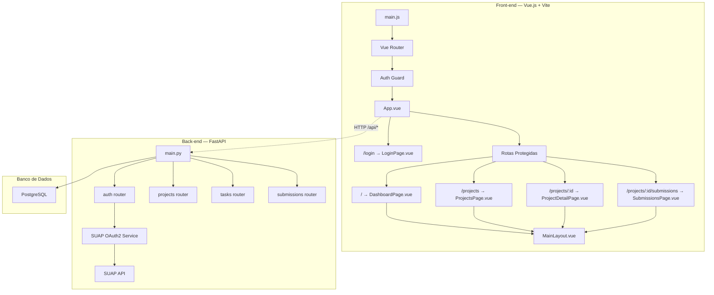

# 📋 SDD — IFAL Projetos: Plano de Implementação

> **Projeto:** IFAL Projetos — Gestão Acadêmica  
> **Stack Front-end:** Vue.js + Vite + Vanilla CSS  
> **Stack Back-end:** FastAPI (Python) + PostgreSQL  
> **Autenticação:** OAuth2 via SUAP (Backend-For-Frontend)  
> **Data:** 26/05/2026

---

## 1. Arquitetura Geral

### 1.1 Visão Macro — Backend-For-Frontend (BFF)

```
[ Front-end: Vue.js ] ──(1. Redireciona)──► [ Tela de Login do SUAP ]
        ▲                                              │
        │                                         (2. Autoriza e retorna Code)
        │                                              ▼
        └──(4. Recebe JWT Próprio)◄── [ Back-end: FastAPI ] ◄──(3. Troca Code por Token do SUAP)
```

O front-end **nunca** se comunica diretamente com o SUAP. Toda interação é intermediada pelo FastAPI, que:
1. Gera a URL de autorização do SUAP e redireciona o usuário
2. Recebe o `authorization_code` via callback
3. Troca o code por um access token do SUAP (server-side)
4. Consulta os dados do usuário na API do SUAP
5. Cria/atualiza o usuário local no PostgreSQL
6. Emite um JWT próprio da aplicação para o front-end

### 1.2 Diagrama de Componentes



---

## 2. Lições do Projeto Anterior

> [!CAUTION]
> O código-fonte anterior (React + Express) foi **descartado integralmente**. Os problemas abaixo servem como guia do que **não** repetir.

| # | Problema | Lição para a nova stack |
|---|----------|------------------------|
| P1 | Classes utilitárias inline sem framework | Usar Vanilla CSS com classes semânticas e `<style scoped>` |
| P2 | Definições CSS duplicadas | Modularizar CSS por componente Vue |
| P3 | Todos os serviços eram mocks estáticos | Implementar API real desde o início com FastAPI |
| P4 | Sessão via localStorage | Usar cookies `httpOnly` + JWT server-side |
| P5 | Sem auditoria de login | Registrar eventos de autenticação desde a Fase 0 |
| P6 | Kanban sem funcionalidade real | Implementar funcionalidade antes de polir visual |
| P7 | Sem CRUD de projetos/submissões | Priorizar CRUD completo nas Fases 1–2 |

---

## 3. Decisões Arquiteturais

> [!IMPORTANT]
> ### D1 — Vanilla CSS (sem Tailwind)
> Seguir exclusivamente com **Vanilla CSS** modular. Componentes Vue usarão `<style scoped>` para estilos locais e `variables.css` para design tokens.

> [!IMPORTANT]
> ### D2 — Autenticação via SUAP (OAuth2 — BFF)
> A autenticação é feita **exclusivamente via SUAP**, usando o padrão Backend-For-Frontend. O front-end redireciona para o SUAP; o FastAPI recebe o `authorization_code`, troca pelo token, consulta dados do usuário e emite um JWT próprio. **Não há cadastro local de senhas.** Detalhes na [Mini-spec de Login](./Mini-spec_Login.md).

> [!IMPORTANT]
> ### D3 — Stack de Backend
> Backend com **FastAPI (Python) + PostgreSQL**, usando **SQLAlchemy** como ORM e **Alembic** para migrations. FastAPI oferece documentação automática (Swagger/OpenAPI), suporte a async e tipagem forte com Pydantic.

> [!IMPORTANT]
> ### D4 — Infraestrutura com Docker e pyproject.toml
> O projeto usa **Docker** para garantir paridade entre ambientes de desenvolvimento e produção. O backend utiliza **`pyproject.toml`** (PEP 621) como fonte única de metadados e dependências, eliminando `requirements.txt` e `setup.py` separados.
>
> **Dockerfiles:**
> - **`backend.Dockerfile`** — Multi-stage build otimizado para produção:
>   - *Stage 1 (builder):* instala dependências em venv isolada a partir do `pyproject.toml`
>   - *Stage 2 (runtime):* copia apenas o venv e o código, imagem slim mínima
> - **`frontend.Dockerfile`** — Build do Vue.js + Vite com Nginx para servir os assets estáticos
> - **`docker-compose.yml`** — Orquestra `backend`, `frontend`, `postgres` e volume persistente

---

## 4. Plano de Ação

### Fase 0 — Infraestrutura, Backend e Autenticação SUAP (Pré-requisito)

| Tarefa | Descrição |
|--------|-----------|
| Inicializar projeto FastAPI | Estrutura de pastas, `main.py`, `pyproject.toml` (PEP 621) |
| Criar `backend.Dockerfile` | Multi-stage build: builder (instala deps do `pyproject.toml`) → runtime (slim + venv) |
| Criar `frontend.Dockerfile` | Build do Vue.js + Vite → Nginx para servir assets |
| Criar `docker-compose.yml` | Orquestração: `backend`, `frontend`, `postgres`, volumes |
| Configurar infraestrutura de testes | Adicionar `pytest`, `pytest-asyncio` e `httpx` no `pyproject.toml`; configurar `tests/conftest.py` com client assíncrono para testes da API |
| Configurar PostgreSQL | SQLAlchemy async + Alembic para migrations |
| Criar models e migrations | Tabelas `users`, `refresh_tokens`, `auth_audit_log` |
| Implementar fluxo OAuth2 SUAP | `GET /api/auth/authorize` → redirect; `GET /api/auth/callback` → JWT |
| Implementar `GET /api/auth/me` e `POST /api/auth/logout` | Endpoints protegidos |
| Middleware de autenticação | `Depends()` para validar JWT |
| Logging de auditoria | Eventos de auth na tabela `auth_audit_log` |
| Escrever testes de integração da API | Testar endpoints de autenticação, fluxos de sucesso/falha e persistência no banco via pytest |

### Fase 1 — Front-end Base + Integração Auth

| Tarefa | Descrição |
|--------|-----------|
| Inicializar Vue.js + Vite | Vue Router + Pinia |
| Layout base | `MainLayout.vue`, `AppHeader.vue`, `SidebarNav.vue` |
| Auth store (Pinia) | Estado global de autenticação, guard de rotas |
| Página de Login | Botão "Entrar com SUAP" → `GET /api/auth/authorize` |
| Sistema de estilos | `variables.css`, `global.css` |
| Proxy do Vite | `/api/*` → FastAPI em dev |

### Fase 2 — CRUD de Projetos e Tarefas

| Tarefa | Descrição |
|--------|-----------|
| API de Projetos | CRUD: `GET/POST/PUT/DELETE /api/projects` |
| API de Tarefas/Kanban | CRUD + movimentação de status |
| Páginas de Projetos | Lista, detalhe, criação/edição |
| Quadro Kanban | Colunas, criação de tarefas, movimentação |
| Controle de acesso por perfil | Middleware FastAPI + guards Vue Router |

### Fase 3 — Entregas e Submissões

| Tarefa | Descrição |
|--------|-----------|
| API de Entregas | Upload, versionamento, download, avaliação |
| Páginas de Entregas | Lista, envio, histórico de versões |
| Integração Git | Vinculação de URL de repositório externo |

### Fase 4 — Estética Premium

| Tarefa | Descrição |
|--------|-----------|
| Redesign do Header | Avatar SUAP, breadcrumbs, busca |
| Dashboard com métricas | Stat cards, ícones, gradientes |
| Animações | `<Transition>` do Vue, fade/slide |
| Empty states | Ilustrações SVG |
| Toast/notificações | Componente de feedback |

### Fase 5 — Polimento Final

| Tarefa | Descrição |
|--------|-----------|
| Skeleton loaders | Carregamento em listas |
| Responsividade | Mobile/tablet |
| Microanimações | Hover, focus, transitions |
| SEO | Meta tags por rota |
| Relatórios com IA | Geração automática (RF010) |

---

## 5. Verificação

### Testes Manuais — Front-end
- Navegar por todas as páginas verificando layout visual
- Testar login/logout via SUAP com cada perfil
- Testar responsividade em mobile (< 768px) e tablet (< 1024px)
- Verificar console do browser para erros

### Testes Automatizados da API — Backend (Pytest)
- Executar suíte de testes com `pytest` e verificar 100% de passagem. Os testes devem cobrir:
  - `GET /api/auth/authorize` (verificar redirect correto para o SUAP)
  - `GET /api/auth/callback` com simulação de código válido (esperar cookie `httpOnly` contendo o JWT e criação de usuário) e inválido (esperar erro HTTP `401`)
  - `GET /api/auth/me` com sessão ativa (verificar retorno dos dados do usuário do SUAP) e inativa (esperar erro HTTP `401`)
  - `POST /api/auth/logout` (verificar remoção de cookies de sessão)
  - Auditoria automática gravada no banco `auth_audit_log` durante todas as ações de auth

### Testes de Integração Front-end ↔ Backend
- Login completo via SUAP → auth store recebe dados
- Expiração de token → redirect para `/login`
- Acesso sem login a rota protegida → redirect para login
