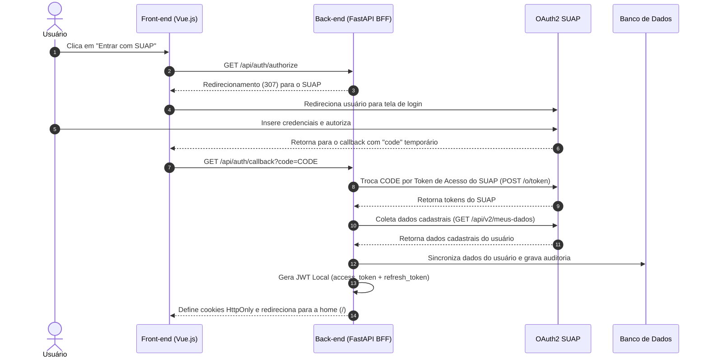

# Relatório de Transição e Handover — Fase 0 (Infraestrutura, Backend e Autenticação SUAP)

Este relatório detalha a conclusão da **Fase 0** do plano de implementação da nova stack de tecnologia do projeto **IFAL Projetos**. O objetivo deste documento é orientar a equipe no entendimento da nova infraestrutura baseada em contêineres e nos mecanismos de autenticação com SUAP implementados sob a arquitetura **BFF (Backend-For-Frontend)**.

---

## 1. Contexto e Nova Stack Tecnológica

Seguindo as novas diretrizes técnicas definidas, toda a base antiga da aplicação foi descartada para dar lugar a uma stack moderna, robusta e escalável:

*   **Front-end:** Vue.js 3 + Vite (Estilização pura em **Vanilla CSS**).
*   **Back-end:** FastAPI (Python 3.11) assíncrono.
*   **Banco de Dados:** PostgreSQL (orquestrado via Docker).
*   **Gerenciamento de Migrações:** Alembic.
*   **Segurança/Autenticação:** Integração OAuth2 SUAP delegada com sessões baseadas em cookies HttpOnly geradas localmente.

---

## 2. Arquitetura de Autenticação (BFF com SUAP)

A autenticação é totalmente gerenciada no backend para evitar que o frontend armazene credenciais sensíveis ou tokens de terceiros. A estrutura do fluxo é a seguinte:



---

## 3. Entregáveis da Fase 0 (100% Concluídos)

Todos os requisitos e componentes da Fase 0 foram codificados, documentados e validados via testes unitários/integração:

### ⚙️ Infraestrutura de Contêineres e Configuração
*   **`backend/pyproject.toml`:** Configuração unificada do projeto seguindo a especificação **PEP 621** contendo dependências do FastAPI, SQLAlchemy Async, Alembic e biblioteca de testes (`pytest`, `pytest-asyncio`, `httpx` e `aiosqlite`).
*   **`backend/backend.Dockerfile`:** Dockerfile multi-stage extremamente otimizado (estágio builder gera o ambiente virtual e estágio runtime final executa a aplicação de forma enxuta baseada em `python:3.11-slim`).
*   **`frontend/frontend.Dockerfile` & `frontend/nginx.conf`:** Dockerfile com Node para build estático e Nginx para servir os arquivos HTML/JS em produção com proxy reverso das chamadas de API para o backend.
*   **`docker-compose.yml`:** Orquestração completa dos serviços de banco (`db`), backend (`backend`) e frontend (`frontend`). 
    > [!IMPORTANT]
    > A porta externa do banco de dados do PostgreSQL no docker-compose foi mapeada para `25432` para evitar conflito com instâncias PostgreSQL que os membros da equipe possuam rodando nativamente em suas portas padrão `5432`.

### 🛡️ Variáveis de Ambiente e Segurança (.env)
Seguindo as melhores práticas de segurança, removemos credenciais fixas do código-fonte e configuramos o suporte a arquivos de ambiente:
*   **`.env`:** Arquivo contendo as variáveis reais do ambiente local (gitignorado).
*   **`.env.example`:** Arquivo modelo contendo **chaves padrão funcionais** (como `mock_client_id`). O comando `cp .env.example .env` gera um ambiente 100% operacional *out-of-the-box* para testes offline e locais instantaneamente.
*   **Integração no Backend:** O backend utiliza `python-dotenv` para ler dinamicamente as variáveis nos ambientes de execução, convertendo adequadamente tipos como expiração de JWT para inteiros.
*   **Integração no Docker Compose:** O arquivo `docker-compose.yml` faz a interpolação das variáveis definidas no `.env` do host, permitindo customizações ágeis e seguras.

### ⛓️ Integração Contínua (GitHub Actions)
*   **`.github/workflows/ci.yml`:** Configurado pipeline de CI automatizado no GitHub Actions que dispara a cada `push` ou `pull_request` nas branches principais (`main`, `master`).
*   **Isolamento:** O pipeline copia o `.env.example` para `.env`, constrói a imagem Docker do backend e executa os testes automatizados com o `pytest` dentro do contêiner, garantindo paridade absoluta entre a máquina do desenvolvedor e o ambiente de integração.

### 🗄️ Persistência de Dados e Migrações
*   **`backend/app/database.py`:** Conexão assíncrona com PostgreSQL (`async_sessionmaker` + `create_async_engine`).
*   **`backend/app/models.py`:** Mapeamento declarativo ORM das tabelas cruciais para segurança:
    *   `users`: Armazena chave primária única (`UUID`), matrícula (`suap_id`), e-mail, nome, cargo/papel (`admin`, `coordinator`, `advisor`, `student`) e status de atividade.
    *   `refresh_tokens`: Tokens criptografados UUID para rotação de sessões persistentes.
    *   `auth_audit_log`: Logs detalhados de todas as ações de autenticação no sistema para conformidade de auditoria.
*   **Alembic Migrations:** Ambiente inicializado, configurado e primeira migration gerada e aplicada com sucesso.

### 🛡️ Endpoints do BFF de Autenticação
*   `GET /api/auth/authorize`: Redireciona o usuário para o SUAP.
*   `GET /api/auth/callback`: Processa a validação do SUAP, persiste/atualiza dados cadastrais locais, cria cookies criptografados HttpOnly seguros `access_token` (15 min) e `refresh_token` (30 min) e redireciona para o front.
    *   **Suporte a Mock para Desenvolvimento Local:** Ao enviar `code=mock_code_student` ou `code=mock_code_advisor`, o backend simula a resposta do SUAP e realiza o login instantaneamente, facilitando testes sem internet ou sem chaves do SUAP.
*   `POST /api/auth/refresh`: Valida o refresh token do cookie, invalida o antigo, rotaciona para um novo token de atualização e renova o access token de forma silenciosa e segura.
*   `POST /api/auth/logout`: Exclui a sessão ativa do banco, registra o log de saída e limpa completamente os cookies do navegador.
*   `GET /api/auth/me`: Retorna os dados cadastrais do usuário atualmente logado baseando-se na validação do cookie de sessão.

---

## 4. Estrutura Atual do Repositório

```text
Projeto-4-Bimestre/
├── .github/
│   └── workflows/
│       └── ci.yml                 # Pipeline de Integração Contínua (GitHub Actions)
├── backend/
│   ├── app/
│   │   ├── app/routers/
│   │   │   ├── __init__.py
│   │   │   └── auth.py             # Endpoints BFF e fluxo OAuth2 SUAP
│   │   ├── __init__.py
│   │   ├── auth_utils.py          # Utilitários de segurança e dependências de JWT
│   │   ├── config.py              # Centralização de variáveis e URLs do SUAP
│   │   ├── database.py            # Sessão assíncrona SQLAlchemy
│   │   ├── main.py                # Ponto de entrada FastAPI e setup CORS
│   │   ├── models.py              # Modelos ORM (User, RefreshToken, AuditLog)
│   │   └── schemas.py             # Schemas de dados Pydantic
│   ├── migrations/                # Scripts de migração do banco de dados (Alembic)
│   ├── tests/
│   │   ├── __init__.py
│   │   ├── conftest.py            # Fixtures de testes assíncronos e DB em memória
│   │   └── test_auth.py           # Testes automatizados de integração do fluxo auth
│   ├── alembic.ini                # Configuração do utilitário Alembic
│   ├── backend.Dockerfile         # Dockerfile otimizado de produção
│   └── pyproject.toml             # Dependências PEP 621 do Python
├── frontend/
│   ├── frontend.Dockerfile        # Dockerfile do front Vue.js + Nginx
│   └── nginx.conf                 # Configuração do Nginx local
├── .env                           # Credenciais locais de desenvolvimento (Não commitar!)
├── .env.example                   # Modelo explicativo de ambiente para a equipe
├── .gitignore                     # Proteção contra vazamento de credenciais e caches
├── docker-compose.yml             # Orquestrador local da infraestrutura
├── implementation_plan.md         # Documento com o roadmap do projeto
├── Mini-spec_Login.md             # Especificação conceitual detalhada do BFF
└── session_handover.md            # Este relatório
```

---

## 5. Como Rodar o Projeto e Executar os Testes

### 🐳 Subindo a Infraestrutura Completa (Desenvolvimento)
Para subir o banco de dados PostgreSQL e os serviços de backend/frontend integrados:
1. Copie o arquivo de exemplo para configurar seu `.env`:
   ```bash
   cp .env.example .env
   ```
2. Suba os contêineres:
   ```bash
   docker compose up --build
   ```
O backend FastAPI estará disponível na porta `8000` (docs Swagger em `http://localhost:8000/docs`).

### 🧪 Executando os Testes de Integração Automatizados (`pytest`)
Para executar os testes de autenticação isolados no contêiner com banco SQLite em memória:
```bash
docker build -t ifal-backend -f backend/backend.Dockerfile backend/
docker run --rm ifal-backend pytest
```

Todos os testes de autenticação cobrem cenários de login bem-sucedidos (aluno/orientador), logout com expiração e destruição de tokens, rotação segura e proteção a rotas autenticadas.
