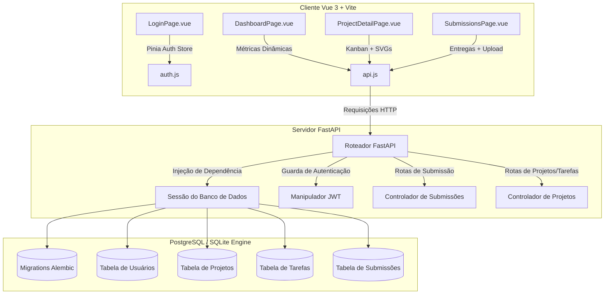

# Transição de Sessão (Handover): Submissões da Fase 3 e Polimento da Interface

Este documento apresenta um relatório técnico detalhado sobre o desenvolvimento realizado na branch `feature/fase3-submissions`, descrevendo a arquitetura do sistema, as decisões de engenharia, o esquema do banco de dados, as especificações de APIs, as alterações nos componentes Vue e as validações de testes.

---

## 📋 Visão Geral

Realizamos com sucesso as seguintes etapas:
1. **Resolução de Conflitos de Merge**: Integração completa entre a branch de entregas (submissions) e o PR #89 (`Nyemoon:projetcsMoon`).
2. **Unificação do Esquema de Banco de Dados**: Consolidação de migrations do Alembic e modelos do SQLAlchemy para suportar entregas de arquivos vinculadas a tarefas do Kanban, histórico de versões, downloads seguros e avaliações de orientadores.
3. **Ajustes de Deploy em Produção**: Configuração de perfis de ambiente na Render (`render.yaml` e FastAPI) para isolar rotas mockadas e garantir autenticação segura via SUAP em produção.
4. **Polimento Estético (Remoção de Emojis)**: Substituição de emojis por ícones vetoriais SVG outline, garantindo um visual limpo e profissional de SaaS empresarial.
5. **Especialização de Painéis por Perfil**: Ajuste dinâmico das métricas exibidas no Dashboard de acordo com o nível de acesso do usuário logado (Orientador, Coordenador, Administrador e Aluno).

---

## 🏗️ 1. Arquitetura do Sistema

A aplicação adota uma arquitetura desacoplada (decoupled fullstack):



### Stack do Backend & Arquitetura BFF (Backend-For-Frontend)
O servidor back-end foi projetado sob o padrão **BFF (Backend-For-Frontend)**, atuando como um intermediário seguro entre a SPA e serviços externos:
- **Framework Web**: FastAPI (v0.100+) com rotas assíncronas.
- **ORM**: SQLAlchemy (v2.0+) utilizando sessões transacionais injetadas via injeção de dependência.
- **Gerenciador de Migrations**: Alembic (v1.11+) controlando as atualizações no banco relacional.
- **Segurança e Isolamento**: Emissão de JWT (JSON Web Tokens) usando algoritmos de criptografia simétrica com suporte a tokens de acesso e tokens de atualização (Refresh Tokens).
- **Mediação do SUAP OAuth2**: Como BFF, o servidor protege segredos institucionais (`SUAP_CLIENT_ID` e `SUAP_CLIENT_SECRET`), impedindo que fiquem expostos no navegador. Ele lida com a troca de tokens do SUAP e devolve tokens JWT próprios para o cliente web.
- **Configuração de Proxy do Vite**: As chamadas do frontend para `/api` são mapeadas via proxy configurado em [vite.config.js](file:///home/archsoney/Projeto-4-Bimestre/frontend/vite.config.js) apontando para o BFF (`http://localhost:8000`), resolvendo políticas de CORS e unificando as rotas de chamada em desenvolvimento e produção.

### Stack do Frontend
- **Framework SPA**: Vue 3 utilizando a Composition API (`<script setup>`).
- **Gerenciamento de Estado**: Pinia stores (`auth.js` para sessão do usuário, `notifications.js` para toasts globais de feedback).
- **Ferramenta de Build**: Vite (v8.0+) integrado com preprocessadores CSS.
- **Estilização**: CSS Vanilla moderno estruturado por variáveis e propriedades customizadas para suporte a glassmorphism e responsividade.

---

## 🛠️ 2. Decisões de Engenharia e Padrões de Projeto

### A. Unificação de Migrations (Integração com o PR #89)
* **O Contexto**: Nossa branch e a branch do PR #89 criaram migrations paralelas para criar a tabela de entregas (`submissions`).
* **A Decisão**: Excluímos a migration duplicada `37ae32bd0f4b` e unificamos as propriedades sob a migration `b6281ee61401` do PR #89 para assegurar uma única trilha sequencial no Alembic. A tabela resultante foi ajustada com os seguintes parâmetros:
  - `file_path`: Expandido para comprimento máximo de `1000` caracteres para acomodar caminhos complexos em servidores de arquivos ou armazenamento em nuvem.
  - `filename` (específico do PR #89) e `original_filename` (específico da nossa branch): Ambos são salvos. O `filename` registra a chave única gerada pelo sistema no disco local, enquanto o `original_filename` preserva o nome original para o download amigável do usuário.
  - `task_title`: Mantido para permitir a associação opcional de entregas a tarefas de Kanban.
  - `feedback`: Definido como tipo `Text` (em vez de VARCHAR comum) para que os orientadores possam fornecer pareceres detalhados.

### B. Seletor de Perfis no Modo de Demonstração (Demo)
* **Fluxo de Desenvolvimento**: Para testar as funcionalidades sem depender do SUAP oficial no ambiente local, implementamos um motor de mock no endpoint `/api/auth/authorize`.
* **Redirecionamento**: Passar o parâmetro `role` (ex: `/api/auth/authorize?role=student`) gera um redirecionamento contendo códigos pré-definidos (`mock_code_student`, `mock_code_advisor`, `mock_code_coordinator`, `mock_code_admin`).
* **Segurança em Produção**: O backend analisa a variável de ambiente `ENV`. Se `ENV=production`, qualquer tentativa de acessar ou processar códigos de mock é rejeitada imediatamente, direcionando o fluxo de forma exclusiva ao protocolo OAuth seguro do SUAP.

### C. Polimento Visual e Remoção de Emojis
* **Substituição por SVGs**: Seguindo a diretriz de manter o portal com aparência SaaS corporativa e profissional, todos os emojis de texto foram removidos e substituídos por SVGs vetoriais customizados:
  - *LoginPage*: Ícones de chapéu de formatura (`student`), fórum acadêmico (`advisor`), maleta de trabalho (`coordinator`) e engrenagem de configuração (`admin`).
  - *ProjectDetailPage*: Ícone de triângulo de exclamação para o status de tarefa atrasada (`overdue`) e ícones de lápis (editar) e lixeira (excluir).
* **Alinhamento e Ajustes CSS**: Configuramos o CSS scoped dos componentes para garantir que os SVGs ficassem centralizados em botões (`display: inline-flex`, `align-items: center`) e que os selos de atraso (`.overdue-badge`) mantivessem o alinhamento com a fonte base sem causar deslocamentos de layout.

### D. Métricas Customizadas por Perfil de Acesso
Ajustamos as estatísticas exibidas no `DashboardPage.vue` de modo a exibir informações relevantes e protegidas:
* **Orientador (Advisor)**: Foca nos projetos sob sua supervisão direta (*Projetos Orientados*), calcula o total de alunos vinculados a esses projetos (*Bolsistas sob Orientação*) e a contagem de submissões pendentes de avaliação (*Entregas Pendentes*).
* **Coordenador (Coordinator)**: Foca na visão geral do sistema. Exibe o total de projetos do portal, busca a lista completa de estudantes via requisição `/api/auth/users?role=student` para listar o total de *Bolsistas Ativos (Sistema)* e monitora todas as submissões pendentes do banco.
* **Administrador (Admin)**: Exibe o total de projetos do sistema, faz uma chamada para `/api/auth/users` para listar todos os *Usuários Cadastrados* no banco de dados e exibe a quantidade total de arquivos submetidos.
* **Estudante (Student)**: Exibe os projetos associados, a contagem de tarefas ativas designadas a ele (*Minhas Tarefas Pendentes*) e a quantidade de entregas feitas (*Minhas Entregas*).

---

## 🗄️ 3. Modelo do Banco de Dados e Esquema

### Tabela: `submissions` (Mapeada via SQLAlchemy)
Código implementado em [models.py](file:///home/archsoney/Projeto-4-Bimestre/backend/app/models.py).

| Nome da Coluna | Tipo SQL | Restrições / Atributos | Descrição |
| :--- | :--- | :--- | :--- |
| `id` | `INTEGER` | Chave Primária, Indexada | Identificador único incremental. |
| `project_id` | `INTEGER` | ForeignKey(`projects.id`), Nullable=False | Projeto associado à submissão. |
| `uploader_id` | `INTEGER` | ForeignKey(`users.id`), Nullable=False | Estudante responsável pelo upload. |
| `file_path` | `VARCHAR(1000)`| Nullable=False | Caminho físico do arquivo no sistema de arquivos. |
| `filename` | `VARCHAR(255)` | Nullable=False | Nome randômico salvo no disco de uploads. |
| `original_filename`| `VARCHAR(500)` | Nullable=False | Nome real do arquivo enviado pelo usuário. |
| `task_title` | `VARCHAR(255)` | Nullable=True | Nome da tarefa Kanban vinculada. |
| `version` | `INTEGER` | Nullable=False, Padrão=1 | Número da versão incremental para aquele projeto. |
| `status` | `VARCHAR(50)` | Nullable=False, Padrão='pending' | Status da avaliação (`pending`, `approved`, `rejected`). |
| `feedback` | `TEXT` | Nullable=True | Parecer textual do avaliador. |
| `score` | `FLOAT` | Nullable=True | Nota opcional atribuída pelo orientador. |
| `uploaded_at` | `DATETIME` | Nullable=False, Padrão=`datetime.utcnow`| Data/Hora da entrega da versão do arquivo. |

---

## 🔌 4. Rotas e Especificações de API

O roteador de entregas está disponível sob o prefixo `/api/submissions` no arquivo [submissions.py](file:///home/archsoney/Projeto-4-Bimestre/backend/app/routers/submissions.py).

### A. Fazer Upload de Entrega
* **Rota**: `POST /api/submissions/{project_id}`
* **Parâmetros**: `project_id` (inteiro na rota).
* **Payload**: Formato `multipart/form-data` contendo:
  - `file`: O arquivo binário. O roteador valida no fluxo se o arquivo possui menos de 10MB (10.485.760 bytes).
  - `task_title`: String opcional vinculando a entrega a uma atividade específica do quadro.
* **Segurança**: O usuário solicitante deve ser participante ativo do projeto ou possuir acesso administrativo global.

### B. Listar Histórico de Entregas
* **Rota**: `GET /api/submissions/{project_id}`
* **Retorno**: Lista de esquemas Pydantic `SubmissionResponse` ordenada por versão decrescente.
* **Segurança**: Restrito a membros do projeto, orientador correspondente, coordenadores ou administradores.

### C. Download de Arquivos
* **Rota**: `GET /api/submissions/{project_id}/download/{submission_id}`
* **Comportamento**: Envia o arquivo como anexo (`FileResponse`), injetando os cabeçalhos apropriados de `Content-Disposition` contendo o `original_filename`.
* **Segurança**: Restrito a usuários vinculados ao respectivo projeto.

### D. Avaliar e Dar Feedback
* **Rota**: `POST /api/submissions/{project_id}/evaluate/{submission_id}`
* **Payload**: JSON validado via esquema `SubmissionEvaluate` (ou `EvaluateRequest` para retrocompatibilidade):
  ```json
  {
    "status": "approved",
    "feedback": "Excelente análise estatística contida nos anexos.",
    "score": 10.0
  }
  ```
* **Segurança**: Permitido apenas para **Orientadores** do projeto, **Coordenadores** ou **Administradores**.

---

## 💻 5. Modificações nos Componentes Frontend

### `LoginPage.vue`
* **Estilo Glassmorphism**: Cards escuros translúcidos com bordas leves e efeitos de profundidade com desfoque de fundo (`backdrop-filter`).
* **Seletor de Perfis**: Botões de perfil com micro-interações que disparam mutações na store de autenticação do Pinia, mudando as credenciais de login simuladas com base no botão clicado.

### `DashboardPage.vue`
* **Busca Concorrente**: Executa a busca de projetos e em seguida resolve tarefas de Kanban e histórico de entregas utilizando promessas paralelas (`Promise.all`), otimizando o carregamento da página.
* **Carregamento de Dados Especiais**: Contém ramificações lógicas para carregar contagens adicionais de usuários do sistema dependendo se a credencial ativa possui permissão administrativa (`admin` ou `coordinator`).

### `ProjectDetailPage.vue`
* **Quadro Kanban**: Renderiza as atividades em três raias distintas (`A Fazer`, `Em Progresso`, `Concluído`).
* **SVG Icons**: Botões de gerenciamento de tarefas estruturados por ícones SVG outline, estilizados com a classe `.action-btn-svg` para assegurar o alinhamento com a grade do CSS.

---

## 🧪 6. Testes e Processo de Validação

### A. Execução dos Testes Pytest
Desenvolvemos o arquivo de cobertura [test_submissions.py](file:///home/archsoney/Projeto-4-Bimestre/backend/tests/test_submissions.py). Executar `backend/venv/bin/python -m pytest -v` processa com sucesso **18 cenários de teste**:
1. Rotas de callback e geração de JWTs correspondentes por perfil mockado.
2. Expiração de tokens e persistência em refresh tokens.
3. Restrição de visualização de projetos a usuários estranhos ao time.
4. CRUD de tarefas Kanban e alteração correta de flags de atraso baseado em timezone UTC do servidor.
5. Auto-incremento de versão no banco de dados na criação de múltiplos envios no mesmo projeto.
6. Bloqueio de upload de arquivos com tamanho superior à restrição física de 10MB.
7. Aplicação de notas de avaliação e persistência de histórico.

### B. Sucesso na Compilação do Frontend
Rodar `npm --prefix frontend run build` gera a build de produção em **3.70 segundos**:
- Todos os componentes Vue (`LoginPage.vue`, `DashboardPage.vue`, `ProjectDetailPage.vue` e `SubmissionsPage.vue`) foram convertidos e minificados com sucesso.
- O bundle principal gerado no diretório `dist/` está pronto para o servidor estático da Render.
